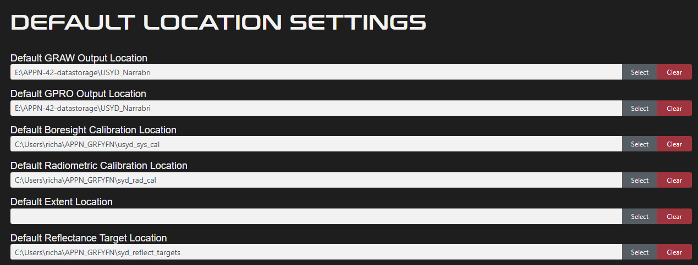
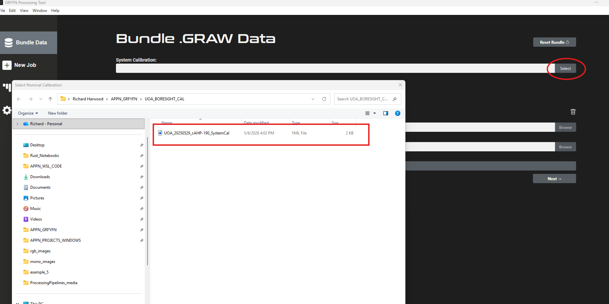
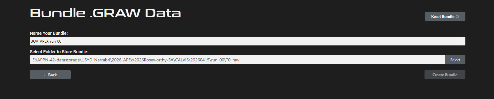
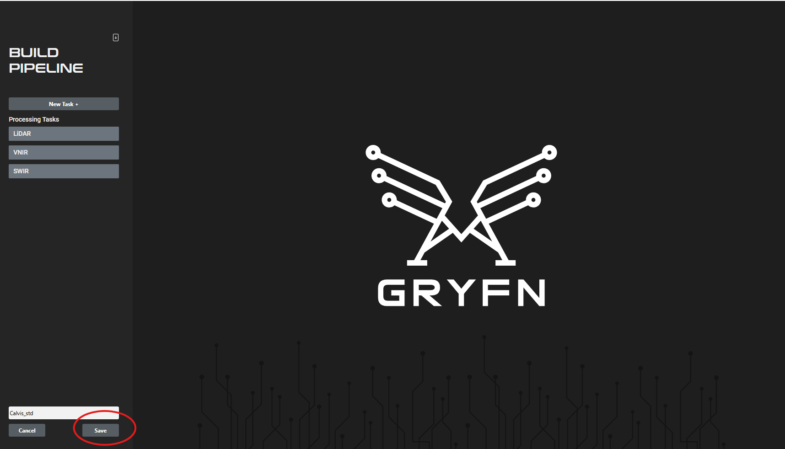
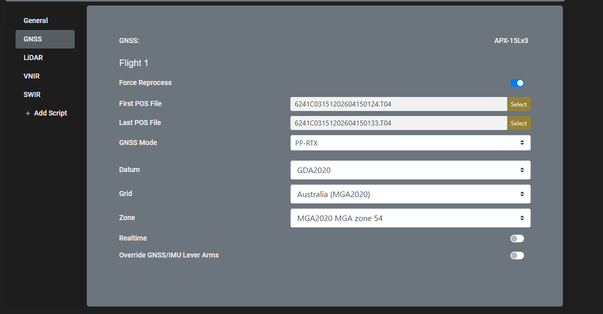
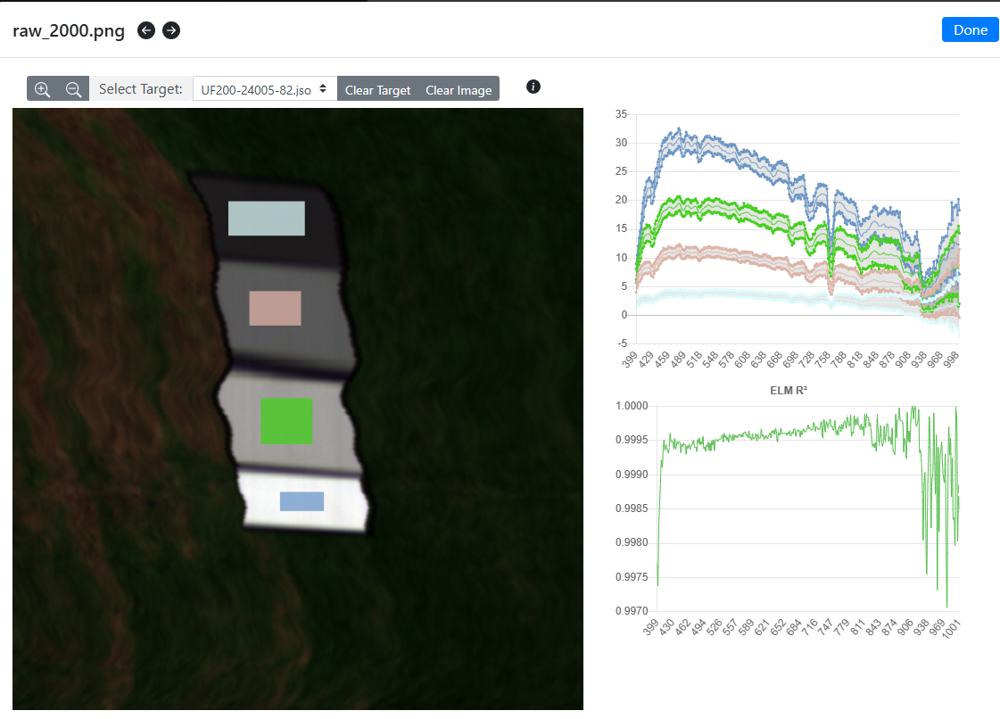

# Processing Pipelines

**Version 0.1 – DRAFT, May 2026**

> [!IMPORTANT]
> This page documents the **standardised GRYFN processing pipelines** used
> within APPN for UAV-based data processing, intended for trained APPN staff
> processing CALViS, GOBI, HiRes, and M3M datasets. Adherence to the
> pipelines below ensures reproducibility, quality assurance, and
> cross-project comparability. For any processing run that **deviates from
> the standard pipeline**, detailed records must be kept of every parameter
> changed, the rationale, and any anticipated implications for data quality.

This page documents the standardised GRYFN processing pipeline YAML files used
within APPN for UAV-based data processing. These YAML configurations define
consistent, transparent, and repeatable processing workflows across
GRYFN-supported sensors and platforms, supporting reproducibility, quality
assurance, and cross-project comparability. The files are intended to be used
as reference and default templates for approved processing pipelines, with any
deviations explicitly documented to maintain traceability and data integrity.

The standard pipelines and the data products they output are detailed below.
For a tabular summary of output formats, resolutions and software
compatibility, see
[Standard Data Products](../../Background/StandardDataProducts/Standard_Data_Products.md).

For additional information about all steps in this document, see the 
[Gryfn Documentation](https://gryfn.gitbook.io/gryfn-software/documentation/quick-start-guide)

> [!IMPORTANT]
> **Document status — work in progress.**
> This page is a draft and requires further revision before it can be
> considered final.
>
> **Outstanding TODOs:**
>
> - [ ] CALViS walkthrough author / reviewer: Richard Harwood.
> - [ ] Add the GOBI standard processing walkthrough (currently outputs only).
> - [ ] Automate handling of GNSS `.TO4` files in the raw-data formatting
>       step.
>
> **Figures to produce** (see master list in [`/IMAGE_TODO.md`](../../../IMAGE_TODO.md))
> - [ ] **Screenshots** — GOBI standard pipeline walkthrough: GPT
>       polygon import, exposure setting, ELM panel selection, and
>       pipeline submission (matching the level of detail used in the
>       CALViS section above)
>       (see [GOBI — Standard Processing Pipeline](#-gobi--standard-processing-pipeline)).

---

## Document Structure

- [🌿 CALViS — Standard Processing Pipeline](#-calvis--standard-processing-pipeline)
  - [1. Configure GPT defaults](#1-configure-gpt-defaults)
  - [2. Format the raw data](#2-format-the-raw-data)
  - [3. Create the graw bundle](#3-create-the-graw-bundle)
  - [4. Load the Calvis_standard_pipeline](#4-load-the-calvis_standard_pipeline)
  - [5. Run the pipeline on a graw](#5-run-the-pipeline-on-a-graw)
  - [CALViS outputs](#calvis-outputs)
- [🌱 GOBI — Standard Processing Pipeline](#-gobi--standard-processing-pipeline)
  - [GOBI outputs](#gobi-outputs)

---

## 🌿 CALViS — Standard Processing Pipeline

This section describes the standard CALViS processing workflow using the
[`Calvis_standard_pipeline_v1.0.yaml`](https://github.com/ArdenB/APPN-Aerial-Standard-Operating-Procedures/blob/main/Protocols/Pipelines/ProcessingPipelines/yaml/Calvis_standard_pipeline_v1.0.yaml)
file in the GRYFN Processing Tool (**GPT, v1.9.2**).

> [!NOTE]
> The pipeline YAML lives in
> [`Protocols/Pipelines/ProcessingPipelines/yaml/`](https://github.com/ArdenB/APPN-Aerial-Standard-Operating-Procedures/tree/main/Protocols/Pipelines/ProcessingPipelines/yaml).
> Download the latest version from the link above before importing it
> into GPT (see [Step 4](#4-load-the-calvis_standard_pipeline)).

### 1. Configure GPT defaults

Before processing any data, configure GPT so that it uses the correct
radiometric calibration files and points to the correct panel target files.

#### Sensor identification (boresight calibration)

Each CALViS unit has a unique sensor identifier embedded in the boresight
calibration filename. The naming convention is:

**Example:** `20250527_cAHP-191_SystemCal.yml`

Where `191` is the USYD sensor number; each CALViS unit is assigned its own
unique number.

> [!IMPORTANT]
> When processing data, you **must** verify that the sensor number in the
> boresight calibration file matches the sensor used for data collection.

#### Radiometric calibration files

Each sensor has an associated set of radiometric calibration files supplied
by GRYFN.

> [!IMPORTANT]
> Verify that the **Radiometric Calibration Location** parameter in GPT
> points to the correct calibration files for your specific sensor(s).

#### Reflectance target values

The Empirical Line Method (ELM) requires accurate reflectance target values
for the calibration panels.

- Four (4) calibration panels are used for the ELM process.
- Each panel has specific, measured target reflectance values.
- These values are unique to your panel set.

> [!IMPORTANT]
> Ensure the **Reflectance Target Location** parameter references the
> correct target values that correspond to your specific calibration
> panels.

### 2. Format the raw data

The example CALViS flight used here is `run_00`, a flight from UOA.

A complete CALViS dataset has four key components — **VNIR, SWIR, LiDAR,
and GNSS** — and these must be arranged correctly before a working graw
can be bundled. The raw data folder will look like this:

> [!NOTE]
> When you download the VNIR data it has the **LiDAR data nested inside**
> the VNIR folder, and the **VNIR dark frames** are in the same folder.
> The **SWIR dark frames** are in a separate folder. The GNSS folder
> contains the relevant `.TO4` files (automated handling is WIP).

### 3. Create the graw bundle

#### Pre-bundle checks

Before each graw, confirm you have:

- [ ] System calibration file (matching the sensor used).
- [ ] Radiometric calibration files.
- [ ] Reflectance target file.

#### Bundling steps

1. **Set the system calibration file** to match the sensor you are using.

   

2. **Choose the raw data path.**

   

3. **Click *Next*** to view the optional parameters.

   

   > [!NOTE]
   > Unless you have a specific reason to set an extent, **leave it
   > blank** — data can be cropped to the hyperspectral capture area
   > later, which is ideal for most standard flights. Other fields here
   > are also optional.

4. **Click *Next***. Give the bundle a logical name and save it under
   `T0_raw`.

   

5. **Click *Create bundle***. You should see a progress report while the
   bundle is being created.

   

### 4. Load the Calvis_standard_pipeline

Import the standard CALViS pipeline YAML
([`Calvis_standard_pipeline_v1.0.yaml`](https://github.com/ArdenB/APPN-Aerial-Standard-Operating-Procedures/blob/main/Protocols/Pipelines/ProcessingPipelines/yaml/Calvis_standard_pipeline_v1.0.yaml))
into GPT before running a job for the first time:

1. Open the pipelines manager.

   

2. Import the `Calvis_standard_pipeline` YAML.

   

3. Confirm the imported pipeline is listed.

   

### 5. Run the pipeline on a graw

1. Select **New Job** and choose **Calvis_std** from the pipelines list.
   Choose your graw, name your gpro, and set the gpro output location.

   

   > [!IMPORTANT]
   > The gpro **must** be saved under `T1_proc`.

2. Configure GNSS processing. We currently recommend **PPRTX**.

   

   > [!CAUTION]
   > Double-check your **Datum**, **Grid**, and **Zone** before
   > continuing. Errors here propagate through every downstream product.

3. Load the reflectance target files. For this example flight we use the
   UOA panel target files.

   

4. **VNIR ELM.** Cycle through the images until you find the four panels,
   then click **Draw target bounds**.

   

   Choose a target to work on:

   

   Hold right-click and drag a rectangle around the panel:

   

   Repeat for the remaining three panels:

   

5. **SWIR ELM.** The process is the same as VNIR.

   

   > [!TIP]
   > The SWIR will have water bands (red box in the figure above) and
   > sometimes rogue values (red circle). As a rule of thumb, **draw
   > normal-sized boxes that cover the panel** rather than cherry-picking
   > small areas to get a neater ELM.

6. Click **Submit**.

### CALViS outputs

The CALViS standard pipeline produces the LiDAR and hyperspectral products
listed below. See
[Standard Data Products](../../Background/StandardDataProducts/Standard_Data_Products.md)
for the canonical specifications, file sizes, and software compatibility.

| Product | Output filename | Resolution | Format | Notes |
|---|---|---|---|---|
| LiDAR Digital Surface Model (DSM) | `LiDAR_DSM.tif` | 8 cm (fixed) | GeoTIFF | Extent: VNIR scene |
| LiDAR Digital Terrain Model (DTM) | `LiDAR_DTM.tif` | 1 m | GeoTIFF | Extent: processing extent |
| Combined LiDAR Point Cloud | `LiDAR_CombinedPointCloud.las` | Native point spacing | LAS | Outliers removed during combination |
| VNIR Orthomosaic | `VNIR_Orthomosaic.bin` | 4 cm (GSD-based) | ENVI (`.bin` + `.hdr`) | binning = 2, radiometric calibration applied |
| SWIR Orthomosaic | `SWIR_Orthomosaic.bin` | 4 cm (GSD-based) | ENVI (`.bin` + `.hdr`) | binning = 2, radiometric calibration applied |

---

## 🌱 GOBI — Standard Processing Pipeline

The GOBI standard processing pipeline is defined by
[`Gobi_standard_pipeline_v1.0.yaml`](https://github.com/ArdenB/APPN-Aerial-Standard-Operating-Procedures/blob/main/Protocols/Pipelines/ProcessingPipelines/yaml/Gobi_standard_pipeline_v1.0.yaml).

> [!NOTE]
> The GOBI standard processing walkthrough is **TODO**. The outputs of the
> standard GOBI pipeline are documented below.

> [!NOTE]
> 🖼️ **Image needed (screenshots):** Step-by-step screenshot sequence
> of the GRYFN Processing Tool (GPT) workflow for GOBI processing —
> polygon import, exposure setting, ELM panel selection, and pipeline
> submission — matching the level of detail used in the CALViS section
> above.

### GOBI outputs

The GOBI standard pipeline produces the LiDAR, hyperspectral, and RGB
products listed below. See
[Standard Data Products](../../Background/StandardDataProducts/Standard_Data_Products.md)
for the canonical specifications, file sizes, and software compatibility.

| Product | Output filename | Resolution | Format | Notes |
|---|---|---|---|---|
| LiDAR Digital Surface Model (DSM) | `LiDAR_DSM.tif` | 8 cm (fixed) | GeoTIFF | Extent: VNIR scene |
| LiDAR Digital Terrain Model (DTM) | `LiDAR_DTM.tif` | 1 m | GeoTIFF | Extent: processing extent |
| Combined LiDAR Point Cloud | `LiDAR_CombinedPointCloud.las` | Native point spacing | LAS | Outliers removed during combination |
| VNIR Orthomosaic | `VNIR_Orthomosaic.bin` | 4 cm (GSD-based) | ENVI (`.bin` + `.hdr`) | binning = 2, radiometric calibration applied |
| RGB Orthomosaic | `RGB_Orthomosaic.tif` | 0.6 cm (fixed) | GeoTIFF | Feature-matching (SIFT) bundle adjustment applied |
