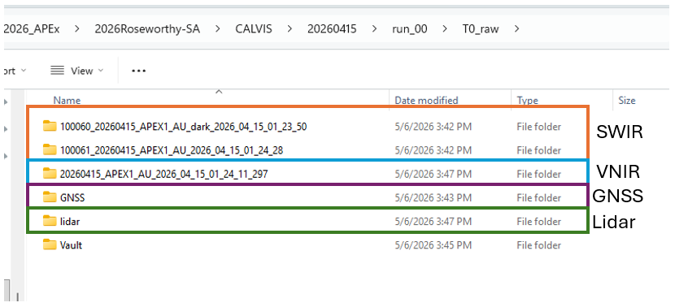
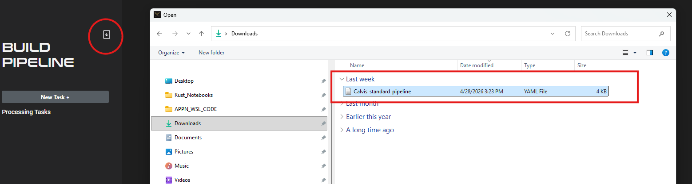
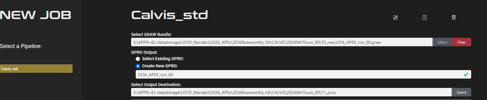
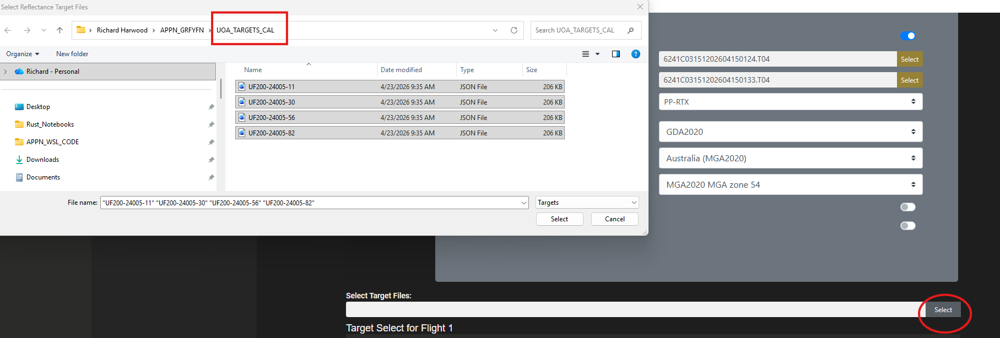
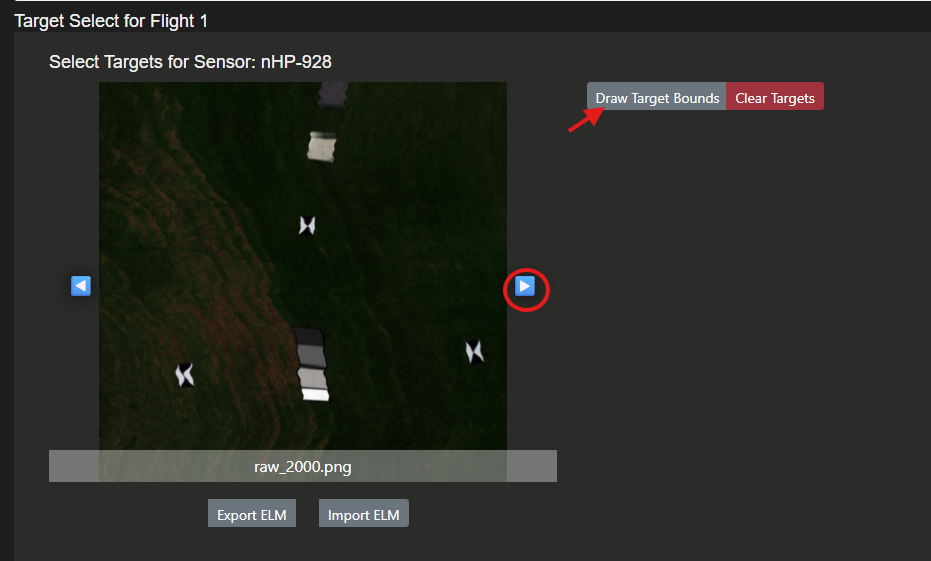
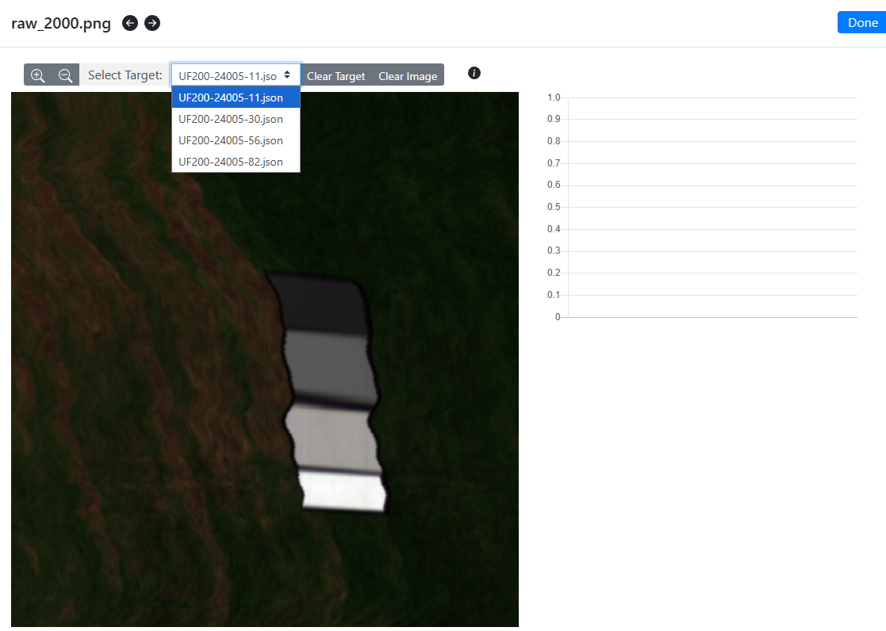
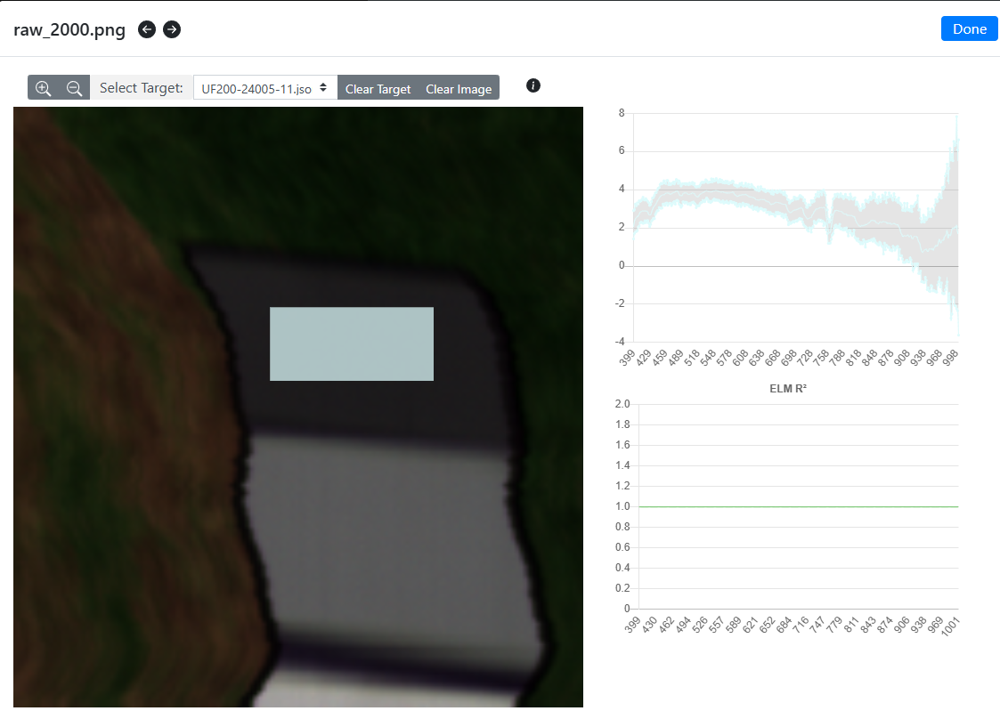

# Processing Pipelines

This page documents the standardised GRYFN processing pipeline YAML files used
within APPN for UAV-based data processing. These YAML configurations define
consistent, transparent, and repeatable processing workflows across
GRYFN-supported sensors and platforms, supporting reproducibility, quality
assurance, and cross-project comparability. The files are intended to be used
as reference and default templates for approved processing pipelines, with any
deviations explicitly documented to maintain traceability and data integrity.

The standard pipelines and the data products they output are detailed below.
For a tabular summary of output formats, resolutions and software
compatibility, see [Standard Data Products](../StandardDataProducts/Standard_Data_Products.md).

---

## 🌿 CALViS — Standard Processing Pipeline

WIP- Richard Harwood 

Using the CALVIS standard YAML (Calvis_standard_pipeline) file in Gryfn Processing Tool (GPT, V.1.9.2)

### 1) Setting up GPT
Firstly we need to configure GPT so that it uses the correct radiometric calibration files and points to where the correct panel target files are stored. 

## CALVIS Boresight Calibration Configuration

### Sensor Identification and Matching

Each CALVIS unit has a unique sensor identifier embedded in the boresight calibration filename. The naming convention follows this format:

**Example:** `20250527_cAHP-191_SystemCal.yml`

Where "191" represents the USYD sensor number. Each CALVIS unit is assigned its own unique number.

**CRITICAL:** When processing data, you must verify that the sensor number in the calibration file matches the sensor used for data collection.

### Radiometric Calibration Configuration

Each sensor hasan associated radiometric calibration files supplied by GRYFN. 

**Required Action:** Verify that the **Radiometric Calibration Location** parameter points to the correct calibration files for your specific sensor(s).

### Reflectance Target Configuration

The Empirical Line Method (ELM) requires accurate reflectance target values for the calibration panels.

**Setup Requirements:**
- Four (4) calibration panels are used for the ELM process
- Each panel has specific, measured target reflectance values
- These values are unique to your panel set

**Required Action:** Ensure the **Reflectance Target Location** parameter references the correct target values that correspond to your specific calibration panels. 

### 2) Formatting the RAW data 

For this example CALVIS flight we will use run_00 a flight from UOA. 

For the CALVIS there are 4 key pieces of data. VNIR, SWIR, LIDAR and GNSS, for a complete dataset and a workign graw we need to set these up correctly. The raw data will look like this: 

It is important to note that when you download the VNIR data it has the LIDAR data inside the folder, the VNIR folder also has the "dark" files in the folder, whilst SWIR they are in a different folder. The GNSS folder contains the relevant .TO4 files (automation of this is WIP) 

### 3) Creating a graw
Checks before each graw:

System Cal

Radiometric Cal

Reflectence Target File

Steps to bundle graw:

Set your system calibration file that matches the sensor you are using.

Choose your raw data path: 

Click next:
Here you will see optional paramaters

Unless there is a specfic reason you need to use an extent leave it blank, we can crop the data to the hyperspectral capture area later which is ideal for most standard flights. Other details are optional. 

Click next 

Give your bundle a logical name and save it in the T0_raw.

Click "create bundle"

You should sell a progress report of your bundling.

### 4) Uploading the Calvis_standard_pipeline

### 4) Using the Calvis_standard_pipeline to process the graw

Select "New Job" and "Calvis_std" from pipelines. Choose your graw, name your gpro and choose where the gpro is saved (T1_proc !!!) 

Next we set up GNSS processing, for now, we encourage using PPRTX.

Here it is super crucial to double check your Datum , Grid and Zone. 

Next, we load the target files, the UOA panels were in this flight so we choose those target files 

Next, we do the VNIR ELM. Cycle through the images until you find the 4 panels and then click draw target bounds 

Next you choose a target you want to work on 

Then by holding right click you draw a recntangle around that panel 

Do the same for the remaining 3 panels 

The process is the same for the SWIR. Note that the SWIR will have water bands (red box) and some times has rogue values (red circle). As a rule of thumb just do normal size boxes that cover the panel (as appose to cherry picking areas with very small boxes to get a neater ELM) 

Hit Submit

### LiDAR-derived products

#### LiDAR Digital Surface Model (DSM)

- **Output:** `LiDAR_DSM.tif`
- **Type:** Raster
- **Resolution:** 8 cm (fixed resolution)
- **Extent:** VNIR scene extent

#### LiDAR Digital Terrain Model (DTM)

- **Output:** `LiDAR_DTM.tif`
- **Type:** DTM
- **Resolution:** 100 cm (1 m)
- **Extent:** Processing extent

#### Combined LiDAR Point Cloud

- **Output:** `LiDAR_CombinedPointCloud.las`
- **Type:** Combined point cloud
- **Notes:** Outliers removed during combination

### Hyperspectral products

#### VNIR Orthomosaic

- **Output:** `VNIR_Orthomosaic.bin`
- **Type:** Orthomosaic (ENVI format, radiance-scaled)
- **Resolution:** 4 cm (GSD-based)
- **Notes:** binning = 2, radiometric calibration applied

#### SWIR Orthomosaic

- **Output:** `SWIR_Orthomosaic.bin`
- **Type:** Orthomosaic (ENVI format, radiance-scaled)
- **Resolution:** 4 cm (GSD-based)
- **Notes:** binning = 2, radiometric calibration applied

---

## 🌱 GOBI — Standard Processing Pipeline

### LiDAR-derived products

#### LiDAR Digital Surface Model (DSM)

- **Output:** `LiDAR_DSM.tif`
- **Type:** Raster
- **Resolution:** 8 cm (fixed resolution)
- **Extent:** VNIR scene extent

#### LiDAR Digital Terrain Model (DTM)

- **Output:** `LiDAR_DTM.tif`
- **Type:** DTM
- **Resolution:** 100 cm (1 m)
- **Extent:** Processing extent

#### Combined LiDAR Point Cloud

- **Output:** `LiDAR_CombinedPointCloud.las`
- **Type:** Combined point cloud
- **Notes:** Outliers removed during combination

### RGB & hyperspectral products

#### VNIR Orthomosaic

- **Output:** `VNIR_Orthomosaic.bin`
- **Type:** Orthomosaic (ENVI format, radiance-scaled)
- **Resolution:** 4 cm (GSD-based)
- **Notes:** binning = 2, radiometric calibration applied

#### RGB Orthomosaic

- **Output:** `RGB_Orthomosaic.tif`
- **Type:** Orthomosaic
- **Resolution:** 0.6 cm (fixed resolution)
- **Notes:** Feature-matching (SIFT) bundle adjustment applied
