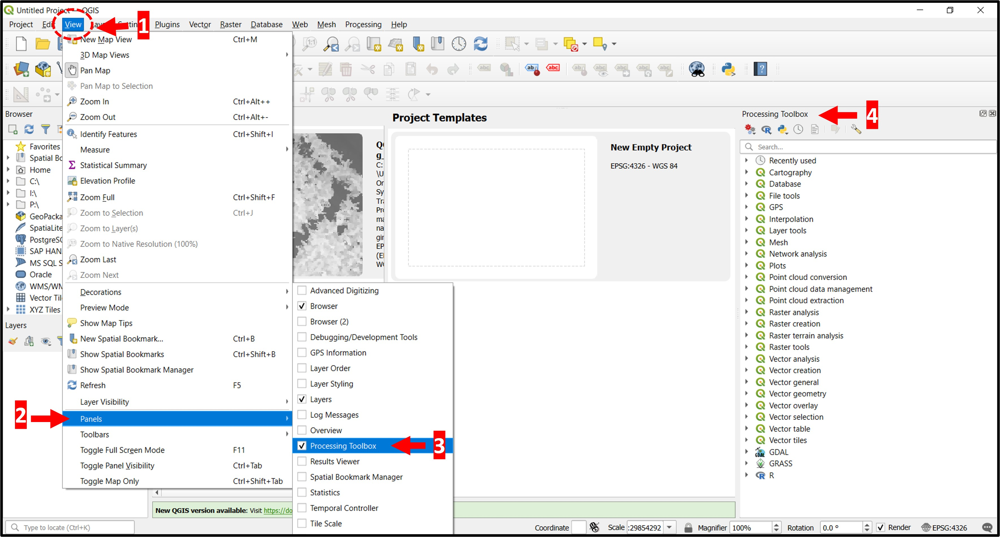
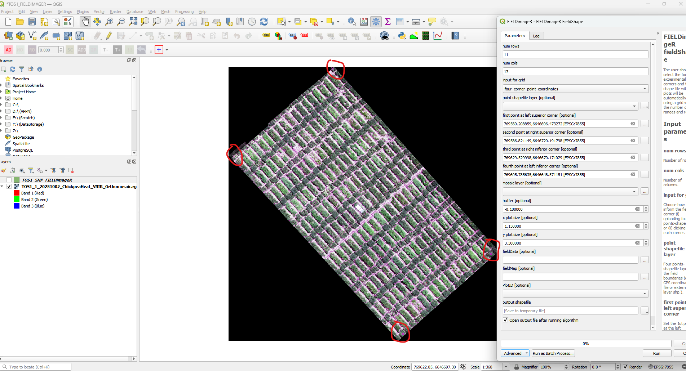
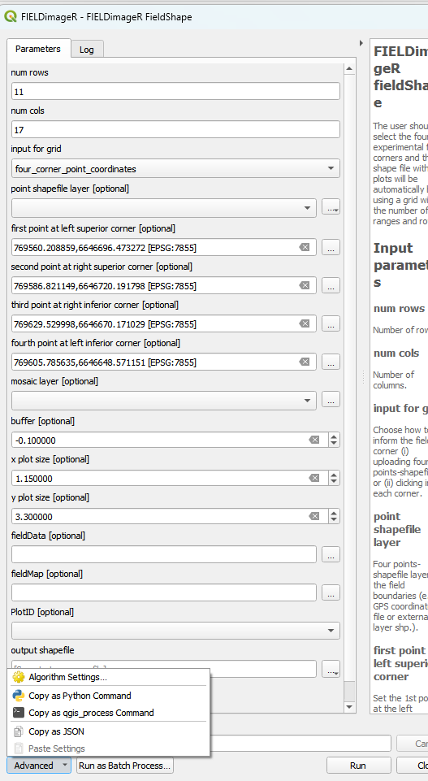
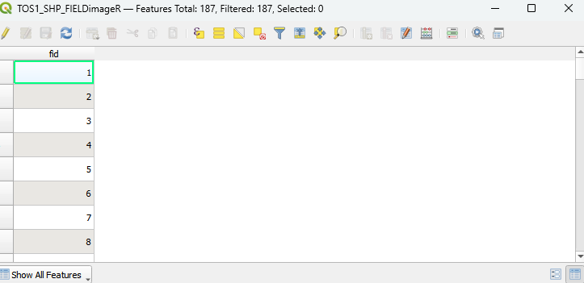

# APPN – Plot Delineation

> [!WARNING]
> **Draft document — large sections require discussion with the APPN
> Field EWG.** Several parts of this protocol (including the recommended
> buffer values, the mandatory file attribute set, and the trial
> information join specification) are placeholders intended to show the
> structure and intent of the standard. They must be reviewed and
> ratified by the Field EWG before being treated as the APPN standard.
> Sections requiring EWG input are flagged inline with `IMPORTANT` 
> callouts and *(TODO: Field EWG Discussion)* in headings.

This protocol defines the APPN standard for plot delineation shapefiles —
their structure, attributes, and storage location within the APPN folder
hierarchy — and documents the supported methods for producing them from
APPN aerial imagery (typically RGB orthomosaics captured by GRYFN UAV
systems). Consistent plot delineation underpins repeatable phenotypic
analysis across APPN trials.

> [!IMPORTANT]
> The APPN plot shapefile specification below must be followed for all
> trials, regardless of which method is used to generate the shapefile.
> For any deviations from this specification or these methods (e.g.
> alternative tools, non-standard plot layouts), keep detailed records of
> the changes made, the rationale, and any implications for downstream
> analysis.

---

## Document Structure

This protocol is organised so you can read it top-to-bottom for the full
APPN plot delineation standard, or jump straight to the section you need.
Sections still pending APPN Field EWG ratification are flagged with
*(TODO: Field EWG Discussion)* in their headings.

- [APPN Plot Delineation](#appn-plot-delineation) — rationale and the
  competing sources of error a standard delineation approach must manage.
  - [Recommended Buffer](#recommended-buffer) — default inward buffer
    values, worked examples, and when to deviate. *(TODO: Field EWG Discussion)*
- [APPN Plot Shapefile Standard](#appn-plot-shapefile-standard) — the
  mandatory file format, attributes, storage location, and naming
  convention every plot layout file must follow.
  - [File format](#file-format) — GeoJSON (preferred) and shapefile
    (also accepted), CRS, and geometry rules.
  - [Required attributes](#required-attributes) — `fid`, `plot_id`, and
    candidate columns under EWG discussion. *(TODO: Field EWG Discussion)*
  - [Storage location](#storage-location) — where the layout file lives
    in the APPN folder structure.
  - [File naming convention](#file-naming-convention-_todo-feild-ewg-discussion)
    *(TODO: Field EWG Discussion)* — proposed `{YYYYSiteName}_{role}_v{NN}`
    scheme and role tags.
- [Joining Trial Information](#joining-trial-information-_todo-feild-ewg-discussion)
  *(TODO: Field EWG Discussion)* — how trial metadata is attached to the
  plot geometry via `plot_id`.
- [Methods](#methods) — supported procedures for generating an
  APPN-compliant plot layout file.
  - [Method 1: FIELDimageR (QGIS)](#method-1-fieldimager-qgis)
  - [Method 2: *(DPIRD METHOD — TODO)*](#method-2-dpird-method--todo)
  - [Method 3: *(GRYFN plot tool — TODO)*](#method-3-gryfn-plot-tool--todo)

---

## APPN Plot Delineation

A standard APPN plot delineation approach ensures that comparable trials can
be analysed consistently across nodes. The goal is to maximise the usable
plot area sampled by the aerial data while minimising two competing sources
of error:

- **Edge effects** — agronomic and radiometric contamination from
  neighbouring plots, alleys, and bare soil at plot boundaries.
- **Positional uncertainty** — small misalignments between the plot
  shapefile and the orthomosaic caused by GNSS/RTK error, orthorectification
  residuals, and sowing/layout drift (rows bowing or skewing relative to
  the design grid as the seeder tracks across the trial).

In practice, this is achieved by applying a consistent inward **buffer** to
each plot polygon so the analysed region sits comfortably inside the true
plot extent, regardless of which method is used to generate the shapefile.

### Recommended Buffer

> [!IMPORTANT]
> The buffer values, worked examples, and guidance in this section are
> **placeholders** derived from a quick literature scan. They are included
> to demonstrate the intended formatting and layout of this section and
> **must not be treated as the APPN standard** until reviewed and approved
> by the APPN Field EWG. The agreed-upon values will replace the numbers
> shown here.

To keep results comparable across nodes, APPN trials should apply a
consistent inward buffer to every plot polygon. The default rule is:

> [!NOTE]
> **APPN default buffer:** 0.3 m from each plot end and 0.2 m from each 
> plot side (across the drill direction), **or** 15% of the corresponding 
> plot dimension — whichever is larger.

The buffer used must be recorded in the tool-specific configuration saved
alongside the shapefile (e.g. the FIELDimageR JSON) so the layout can be
reproduced.

#### Worked examples

| Plot size (L × W)              | Buffer (end / side) | Analysis area (L × W)   | % of plot |
| ------------------------------ | ------------------- | ----------------------- | --------- |
| 6 m × 2 m (cereal yield plot)  | 0.5 m / 0.25 m      | 5.0 m × 1.5 m           | ~63%      |
| 4 m × 1.5 m (small breeding)   | 0.3 m / 0.2 m       | 3.4 m × 1.1 m           | ~62%      |
| 2 m × 1 m (micro-plot)         | 0.2 m / 0.15 m      | 1.6 m × 0.7 m           | ~56%      |
| 10 m × 3 m (agronomy strip)    | 1.0 m / 0.5 m       | 8.0 m × 2.0 m           | ~53%      |

#### When to increase the buffer

- Coarser GSD (e.g. hyperspectral at ~5 cm vs RGB at ~1 cm).
- Tall or lodging-prone canopies where canopy lean shifts the visible plot
  off its sown footprint.
- Narrow alleys (<0.5 m) where neighbouring canopies merge.
- Trials without RTK GNSS or without ground control points (GCPs) in the
  orthomosaic.

#### When a smaller buffer may be acceptable

- RTK-georeferenced GCPs present in the orthomosaic.
- Wide alleys with bare inter-row visible between plots.

> [!NOTE]
> Any deviation from the default buffer must be recorded with the trial's
> plot layout files and justified in the trial notes.

---

## APPN Plot Shapefile Standard

All APPN plot shapefiles must conform to the following standard so that
downstream pipelines can ingest them without trial-specific configuration.

### File format

- **Primary format:** **GeoJSON** (`.geojson`) — a single, plain-text,
  self-contained file. See
  [File Format — GeoJSON vs Shapefile](../../QA/QAprocess/AerialDataQC.md#file-format--geojson-vs-shapefile)
  in the Aerial Data QC protocol for the full rationale (single-file
  packaging, version-control friendliness, no field-name length or file
  size caps, open web-native standard).
- **Also accepted:** ESRI Shapefile (`.shp` plus its sidecar files
  `.shx`, `.dbf`, `.prj`, `.cpg`). All sidecar files must be kept
  together with the `.shp`. Shapefiles already in use do **not** need to
  be re-created; new files should be saved as `.geojson`.
- **CRS:** the CRS of the source orthomosaic (typically the correct zone
  of GDA2020). For GeoJSON, keep the file in the projected CRS of the
  orthomosaic rather than reprojecting to WGS84 (see the linked rationale
  above). For shapefiles, the `.prj` file must be present and correct.
- **Geometry:** one polygon per plot. Polygons should be rectangular and
  aligned to the trial layout, sized to the plot dimensions minus the
  inward buffer applied to mitigate edge effects.
- **Optional companion copy:** a second copy of the same layer in the
  other supported format may be saved alongside the primary file using
  the **same base file name** (e.g. `MyTrial_plots.geojson` →
  `MyTrial_plots.shp`). This is useful for tools that only consume one
  format, but is not required.

### Required attributes

> [!IMPORTANT]
> The exact set of **mandatory** attribute columns is still **to be agreed
> by the APPN Field EWG**. The lists below are placeholders showing the
> intended structure and the kinds of columns under consideration; they
> must not be treated as the final standard until ratified.

Each plot polygon should carry, at minimum:

- `fid` — unique polygon identifier assigned by the delineation tool
  (e.g. FIELDimageR's sequential `fid`). It identifies the *geometry*
  only and may not match the trial's plot numbering.
- `plot_id` — plot number from the trial design / sowing plan. This is
  the **join key** used to attach trial metadata to the geometry (see
  [Joining Trial Information](#joining-trial-information)).

> [!NOTE]
> `fid` and `plot_id` must be kept as **separate columns**. `fid` is the
> tool's internal polygon ID; `plot_id` is the agronomic plot number from
> the trial design. Conflating the two breaks reproducibility when the
> shapefile is regenerated and `fid` values shift.

#### Candidate mandatory plot-identification columns (_TODO: Feild EWG Discussion)

Used to locate a plot within the trial layout:

- `range` — range (column) index in the trial design.
- `row` — row index in the trial design.
- `block` / `replicate` — replication block identifier.
- `is_buffer_plot` — Boolean flag (`True`/`False`) marking *buffer plots*
  (filler / border plots sown around the trial edge to absorb edge
  effects). These polygons are still delimited so they can be visualised
  and excluded from analysis, but they carry no experimental treatment.
  Not to be confused with the inward analysis **buffer** applied to
  every plot polygon (see [Recommended Buffer](#recommended-buffer)).

(`plot_id` is listed above as part of the minimum set, since it is the
join key.)

#### Candidate mandatory biological / treatment columns (_TODO: Feild EWG Discussion)

Used to describe what is in the plot:

- `crop` — crop type (e.g. *Wheat*).
- `species` — crop species (e.g. *Triticum aestivum*).
- `genotype` / `entry` — variety, line, or accession code.
- `treatment` — agronomic or experimental treatment applied to the plot.

#### Candidate provenance columns (_TODO: Feild EWG Discussion)

Used to trace how the polygon was produced:

- `method` — delineation method (e.g. `FIELDimageR`).
- `buffer_end_m`, `buffer_side_m` — buffer values applied (in metres).
- `source_ortho` — filename or ID of the orthomosaic the polygon was fit to.
- `created` — ISO date the shapefile was generated.

> [!NOTE]
> The columns required to **join trial information** from the trial
> spreadsheet are still to be defined. At a minimum, the shapefile and
> the spreadsheet must share `plot_id` so that the join described in
> [Joining Trial Information](#joining-trial-information) can be
> performed reliably. `fid` should not be used as the join key — it is
> tool-assigned and may change when the shapefile is regenerated. 

### Storage location

Save the plot layout file (GeoJSON, or shapefile with all its sidecar
files) in the site-level `Documentation/Plot_Layout/` directory under the
APPN folder structure (see the
[APPN folder structure wiki](https://github.com/ArdenB/APPN_GenricFileStorage/wiki/Folder-Structure)
for the full naming convention).

Formal path:

```
{Node}/
  {YYYY_ProjectDesc[_I|E][_Researcher][_org]}/
  {YYYYSiteName[_F|C]}/Documentation/Plot_Layout/
```

Example:

```
USYD_Narrabri/2025_SIFOzBarley/2025IAWatson_F/Documentation/Plot_Layout/
```

Also save the tool-specific configuration used to generate the layout
file (e.g. the FIELDimageR JSON settings) alongside it so the layout can
be reproduced.

### File naming convention (_TODO: Feild EWG Discussion)

> [!IMPORTANT]
> The file naming convention below is a **placeholder** and is **subject
> to APPN Field EWG discussion and approval**. It is provided to show the
> intended structure (site identifier + role suffix + revision) and the
> kinds of role suffixes that may be needed; the final scheme will
> replace what is shown here. 

> [!IMPORTANT]
> THESE NAMES SUCK. 
> TO DO: GET TAM, CONNOR AND RICHARD TO HELP REDSIGN THIS COMPLETLY


A site's `Plot_Layout/` directory may contain more than one plot
shapefile — for example, the main analysis layout plus one or more
exclusion layers covering areas affected by destructive field
interventions (biomass cuts, manual sampling quadrats, damaged plots,
etc.). A consistent naming convention keeps these distinguishable.

Proposed format:

```
{YYYYSiteName}_{role}[_v{NN}].{ext}
```

| Field | Notes |
| --- | --- |
| `{YYYYSiteName}` | Site identifier (year + site name), matching the parent folder name with the `_F` suffix dropped. Plot layouts only apply to field sites. |
| `{role}` | Short role tag describing what the layer represents (see below). |
| `_v{NN}` | Optional zero-padded revision (`_v01`, `_v02`, …). Bump on any change to geometry or attributes. |
| `{ext}` | `geojson` (preferred). `shp` (with sidecars) is also accepted; an optional companion copy in the other format may be saved alongside. |

Proposed role tags:

- `plots` — the primary analysis layout (one polygon per plot, buffer
  applied per the [APPN Plot Shapefile Standard](#appn-plot-shapefile-standard)).
- `plots_raw` — unbuffered or pre-buffer plot footprints, if retained.
- `exclude_biomass` — areas removed for biomass cuts.
- `exclude_sampling` — areas removed for other destructive sampling
  (manual quadrats, soil cores, etc.).
- `exclude_damage` — plots or sub-areas excluded due to damage,
  lodging, weed pressure, or other quality issues.
- `gcp` — ground control point locations, if stored alongside the
  layout.

Examples (within
`USYD_Narrabri/2025_SIFOzBarley/2025IAWatson_F/Documentation/Plot_Layout/`):

```
2025IAWatson_plots_v01.geojson       (preferred primary file)
2025IAWatson_plots_v01.shp           (+ .shx .dbf .prj .cpg — optional companion)
2025IAWatson_plots_v01.json          (FIELDimageR settings)
2025IAWatson_exclude_biomass_v01.geojson
```

> [!NOTE]
> Exclusion layers should use the **same CRS and `plot_id` scheme** as
> the primary `plots` layer so that downstream pipelines can spatially
> subtract or flag affected plots without additional configuration.

---

## Joining Trial Information (_TODO: Feild EWG Discussion)

> [!IMPORTANT]
> **TODO / TBD — pending APPN Field EWG approval.**
> The trial information spreadsheet specification (mandatory columns,
> file format, naming convention, and storage location) and the
> end-to-end procedure for joining it onto the plot shapefile are still
> to be defined. The placeholder workflow below illustrates the intended
> approach using `plot_id` as the join key, but is **not** the ratified
> APPN standard.
>
> Open questions for the EWG include:
>
> - Required vs. optional columns in the trial spreadsheet (e.g. `plot_id`,
>   `range`, `row`, `block`/`replicate`, `crop`, `species`, `genotype`,
>   `treatment`).
> - Preferred file format (`.csv` vs `.xlsx`) and naming convention.
> - Where the trial spreadsheet lives in the APPN folder structure
>   (likely under `Documentation/`).
> - Whether the join should be performed once at trial setup, or
>   re-applied each time the shapefile is regenerated.
> - Whether the joined output should overwrite the source shapefile or
>   be saved as a separate `*_joined.shp`.

Most delineation tools produce a shapefile whose plots are identified
by a tool-assigned `fid` plus the design's `plot_id`. Trial metadata is
attached as a separate step using `plot_id` as the join key:

1. Prepare a spreadsheet (CSV or XLSX) of trial information with one row
   per plot and a `plot_id` column whose values match the shapefile's
   `plot_id`.
2. In QGIS, load both layers and use **Properties → Joins** on the
   shapefile to join the spreadsheet on the `plot_id` field. Do not use
   `fid` as the join key — it is tool-assigned and may change when the
   shapefile is regenerated.
3. Export the joined layer back to a shapefile in the same `Plot_Layout`
   directory so the trial metadata is persisted in the `.dbf`.

---

## Methods

The following methods are supported for generating an APPN-compliant plot
shapefile. Choose the method that best matches your imagery and tooling;
the resulting shapefile must satisfy the
[APPN Plot Shapefile Standard](#appn-plot-shapefile-standard) above.

- [Method 1: FIELDimageR (QGIS)](#method-1-fieldimager-qgis)
- *(Additional methods to be added.)* (_TODO: Feild EWG Discussion)

---

## Method 1: FIELDimageR (QGIS)

FIELDimageR is an R-based plugin run from within QGIS that builds plot
polygons from a georeferenced orthomosaic.

### Software Installation

Install the following software to start the pipeline:

1. [R](https://www.r-project.org/)
2. [QGIS](https://qgis.org/en/site/)

> [!NOTE]
> The first time you run FIELDimageR-QGIS it may take some time to install
> all required R packages.

#### Enable the Processing Toolbox in QGIS

Make sure the **Processing Toolbox** panel is visible in QGIS:

1. Open the **View** menu.
2. Select **Panels**.
3. Enable **Processing Toolbox**.
4. Confirm the Processing Toolbox is now showing on the right-hand side.



#### Install the Processing R Provider plugin

Install the **Processing R Provider** plugin in QGIS:

1. Open the **Plugins** menu.
2. Select **Manage and Install Plugins**.
3. Switch to the **All** tab.
4. Search for *Processing R Provider*.
5. Click **Install Plugin**.
6. Verify that **R** now appears in the Processing Toolbox.


#### Install FIELDimageR

1. Go to the FIELDimageR-QGIS GitHub repository:
   [https://github.com/filipematias23/FIELDimageR-QGIS](https://github.com/filipematias23/FIELDimageR-QGIS).
2. Click **Code**.
3. Select **Download ZIP**.
4. Unzip the archive and copy the functions from the `rscripts` folder
   into your **QGIS R scripts** folder.
5. To locate the QGIS R scripts folder, go to
   **QGIS → Processing Toolbox → Options** (the wrench icon).
6. Under **Providers**, click **R**.
7. Copy the path shown for **R scripts folder** and open it in your file
   explorer.
8. Paste the FIELDimageR functions downloaded from GitHub into the
   `rscripts` folder.


### Generating the Plot Shapefile

With FIELDimageR set up, you can now generate plot shapefiles from your
aerial imagery.

1. Load an image into QGIS. An RGB orthomosaic from a GRYFN drone is the
   easiest starting point.

   

2. Open the **fieldShape** module from the Processing Toolbox.

   

3. Fill in the module parameters:
   - Number of **rows** and **columns**.
   - The **corners** of the trial area (most critical for an accurate
     fit).
   - **Plot size**.
   - **Buffer** — essential for establishing a common analysis area by
     mitigating edge effects.

4. Click **Run**.

   

5. The plot shapefile will be generated.

> [!NOTE]
> Achieving a perfect fit usually takes some iteration on the corner
> coordinates. (_TODO: improve this workflow._)

#### Save your settings

Save your fieldShape settings before closing the tool — inputs will be
wiped if FIELDimageR is closed.



Use **Copy as JSON** and save the contents as a text file alongside the
shapefile in the trial's `Plot_Layout` directory.

### Output

The shapefile produced by FIELDimageR contains plots identified only by
`fid`.



Attach trial metadata as described in
[Joining Trial Information](#joining-trial-information), then save the
final shapefile to the trial's `Plot_Layout` directory per the
[APPN Plot Shapefile Standard](#appn-plot-shapefile-standard).

---

## Method 2: DPIRD Field Mapping Tool

The DPIRD Field Mapping Tool is a desktop application for digitising and
managing agricultural field trial plot boundaries over drone orthomosaic
imagery. Built with [Streamlit](https://streamlit.io/) and Python
geospatial libraries, it runs locally in your web browser with no cloud
dependency.

Developed at the
[Department of Primary Industries and Regional Development (DPIRD)](https://www.dpird.wa.gov.au/),
Western Australia, as part of the
[Australian Plant Phenomics Network (APPN)](https://www.plantphenomics.org.au/).

### Features

- **Generate Grid** — Create regular plot grids over drone orthomosaics
  by drawing a trial boundary and specifying banks, rows, buffer, and
  plot dimensions. 
- **Edit Grid** — Interactive browser-based polygon editor with drag,
  vertex editing, multi-select, copy/paste, measurements, undo, and
  keyboard shortcuts.
- **Convert File** — Convert between Shapefile, GeoJSON, GeoPackage,
  and KML formats with optional CRS reprojection (GDA2020, GDA94,
  WGS 84, or custom EPSG).
- **Cropping Tool** — Crop rasters (orthophotos, DSMs, GeoTIFFs) to
  individual plot polygon boundaries, producing one file per plot.

All data is processed locally. No internet connection is required after
installation.

**Detailed installation instruction and documentation is provided in the [DPIRD Field Mapping Tool Documentation](https://github.com/appndpird/DPIRDFieldMappingTool/blob/main/DPIRD_Field_Mapping_Tool_Documentation.pdf) within the GitHub repository. Basic guidelines are provided below.**

### Software Installation

Go to the GitHub repository
[appndpird/DPIRDFieldMappingTool](https://github.com/appndpird/DPIRDFieldMappingTool)
and download the repository (click **Code → Download ZIP**, or
`git clone`). The repository contains two platform-specific
distributions — choose the one that matches your operating system.

#### Requirements

| | Windows | Linux / macOS |
|---|---|---|
| **OS** | Windows 10+ (64-bit) | Ubuntu 20.04+, Fedora, macOS 11+ |
| **Python** | Bundled via Miniconda | User-installed Anaconda/Miniconda |
| **Disk space** | ~2 GB | ~2 GB |
| **Internet** | First-time setup only | First-time setup only |

#### Windows

1. Extract `DPIRD_Field_Mapping_Tool_windows_v1.6.0`.
2. Place
   [`Miniconda3-latest-Windows-x86_64.exe`](https://repo.anaconda.com/miniconda/Miniconda3-latest-Windows-x86_64.exe)
   in the folder.
3. Double-click `Install_DPIRD_Tool.bat` and press `Y`.
4. Double-click `Run_DPIRD_Tool.bat` to launch.

#### Linux / macOS

1. Extract `DPIRD_Field_Mapping_Tool_linux_v1.6.0`.
2. Ensure [Anaconda or Miniconda](https://docs.anaconda.com/miniconda/)
   is installed.
3. Run:

   ```bash
   chmod +x install_dpird_tool.sh run_dpird_tool.sh
   ./install_dpird_tool.sh
   ./run_dpird_tool.sh
   ```

The tool opens in your browser at
[http://localhost:8501](http://localhost:8501).

### Generating the Plot Shapefile

1. Open the tool and navigate to the **Generate Grid** tab.

2. Enter your project folder path (the folder containing the
   orthomosaic `.tif` file). Click **Browse** or paste the path
   directly.

3. Select the orthomosaic file from the dropdown. Optionally select a
   CSV file to attach additional plot metadata.

4. Set the grid parameters:

   | Parameter | Description |
   |---|---|
   | **Banks** | Number of banks (columns) in the X direction. |
   | **Rows** | Number of rows in the Y direction within each bank. |
   | **Buffer (m)** | Gap between adjacent plots in metres. |
   | **Plot Size (W,H)** | Width and height of each plot in metres, comma-separated (e.g. `4,1`). |

5. Draw a boundary polygon on the map by clicking the four corners of
   the trial area in this order:

   **Top-left (B1R1) → Top-right (BXR1) → Bottom-right (BXRY) →
   Bottom-left (B1RY)**

   The first point defines the origin of the grid (plot B1R1). The
   orientation of the boundary polygon determines the rotation of the
   generated grid.

6. Click **Generate Grid**. Review the generated grid on the map and in
   the data table.

7. Fine-tune if needed — changing any grid parameter after generation
   automatically regenerates the grid using the same boundary.

8. Click **Save Initial Grid** to save as a shapefile.

#### Plot ID Convention

Plots are assigned IDs automatically:

| Field | Formula | Examples |
|---|---|---|
| `Plot_ID` | Bank × 1000 + Row | B1R1 = 1001, B2R3 = 2003 |
| `B/R` | Bank-Row label | B1R1, B2R3, B12R6 |
| `Bank` | Bank number | 1, 2, 3, … |
| `Row` | Row number | 1, 2, 3, … |

### Editing the Plot Shapefile

After generating (or loading an existing grid via the **Edit Grid**
tab), click **Edit Grid** to open the interactive browser-based polygon
editor in a new tab. The editor provides:

| Tool | Shortcut | Description |
|---|---|---|
| Navigate | `Esc` | Pan and zoom. Click a polygon to select it. |
| Drag Plots | `D` | Drag polygons to reposition. Ctrl/Cmd+Click to multi-select. |
| Edit Vertices | `V` | Drag individual corner vertices to reshape polygons. |
| Delete | `X` | Click a polygon to remove it. |
| Draw New | `N` | Click to place vertices; double-click to close. |
| Measurements | `M` | Toggle edge length labels (metres) on all polygons. |
| Copy / Paste | `Ctrl+C` / `Ctrl+V` | Duplicate selected polygons. |
| Undo | `Ctrl+Z` | Revert the last action (up to 50 steps). |
| Select All | `Ctrl+A` | Select all polygons. |

> [!NOTE]
> On macOS, use **Cmd** instead of **Ctrl** for all keyboard shortcuts.

Click **Save Shapefile** in the editor to write the edited grid to disk,
or **Export GeoJSON** to download a GeoJSON file.

### Converting Vector Data File Formats

Use the **Convert File** tab to convert the output shapefile to GeoJSON or reproject to a different CRS:

1. Load the shapefile via **Browse Input File**.
2. Set the output format to **GeoJSON**.
3. Select the target CRS (typically the CRS of the source orthomosaic,
   e.g. GDA2020 / MGA Zone 50).
4. Click **Convert & Save**.

### Cropping Rasters to Plots

Use the **Cropping Tool** tab to crop the orthomosaic (or DSM) to
individual plot boundaries:

1. Load the plot shapefile and the raster file.
2. Choose a save folder and base filename.
3. Click **Crop and Save**.

For a grid with multiple polygons, one raster is saved per plot (e.g.
`cropped_1001.tif`, `cropped_2003.tif`). The tool automatically
reprojects the vector to match the raster's CRS if they differ.

### Output

The shapefile produced by the DPIRD Field Mapping Tool contains plots
identified by `Plot_ID` (Bank × 1000 + Row), `B/R`, `Bank`, and `Row`.
To produce an APPN-compliant plot shapefile:

1. **Rename** `Plot_ID` to `plot_id` (or add a `plot_id` column mapped
   from `Plot_ID`) to match the
   [Required attributes](#required-attributes) specification.
2. **Add** an `fid` column if not already present (sequential polygon
   identifier).
3. **Convert** to GeoJSON using the Convert File tab if the primary
   deliverable should be `.geojson`.
4. Attach trial metadata as described in
   [Joining Trial Information](#joining-trial-information-_todo-feild-ewg-discussion),
   then save the final file to the trial's `Plot_Layout` directory per
   the [APPN Plot Shapefile Standard](#appn-plot-shapefile-standard).

### Further Documentation

Detailed installation instruction and documentation: [DPIRD Field Mapping Tool Documentation](https://github.com/appndpird/DPIRDFieldMappingTool/blob/main/DPIRD_Field_Mapping_Tool_Documentation.pdf).

---

## Method 3: *(GRYFN plot tool — TODO)*

> [!IMPORTANT]
> **TODO:** Document the GRYFN plot tool workflow for generating
> APPN-compliant plot layout files.

> [!NOTE]
> Additional plot delineation methods will be documented here as they
> are adopted by APPN.

---
