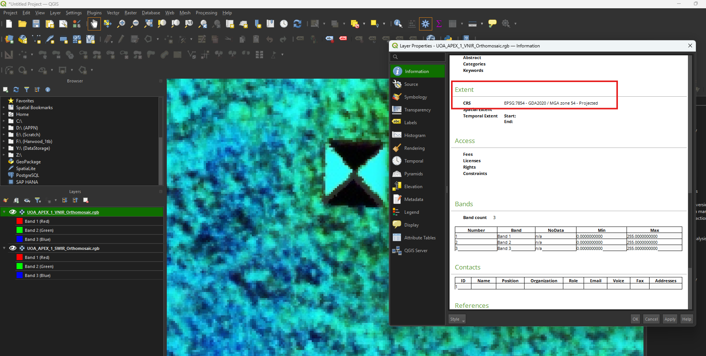
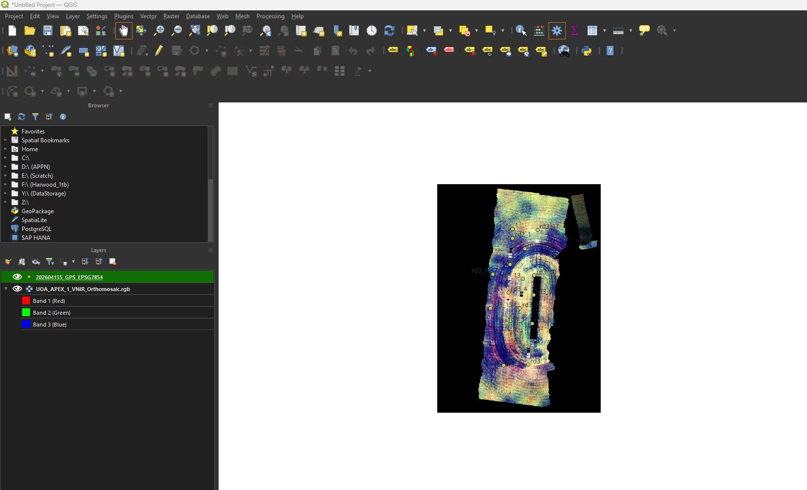
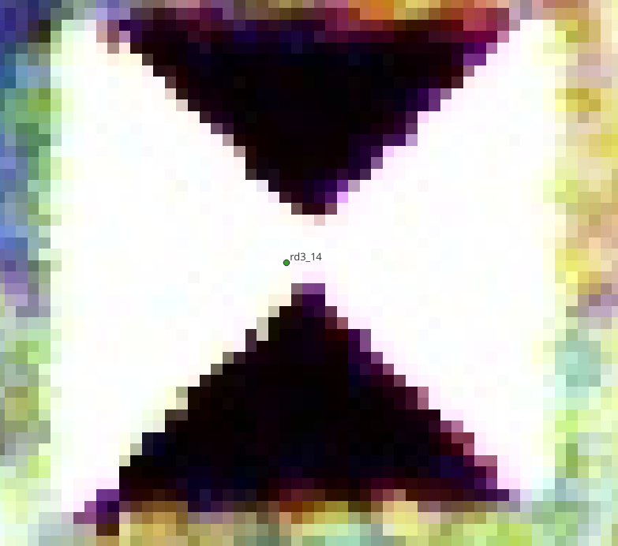
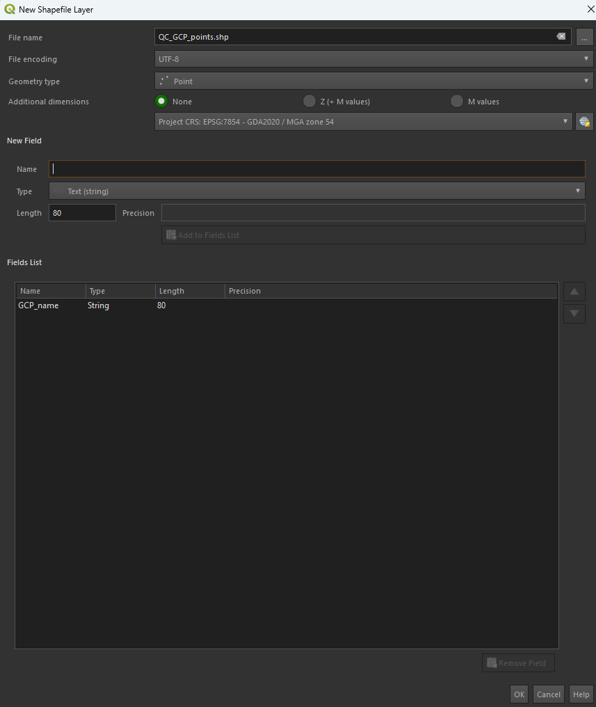
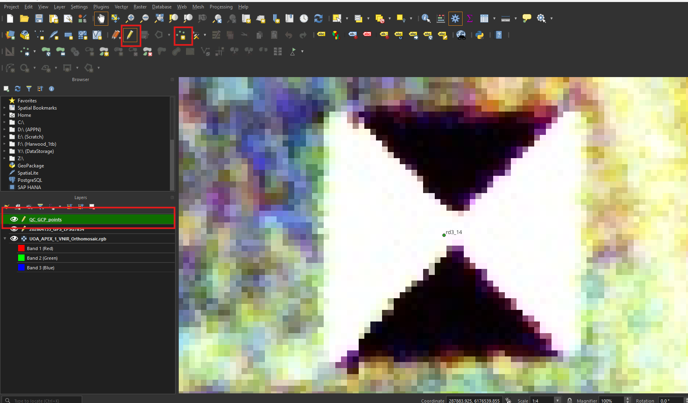
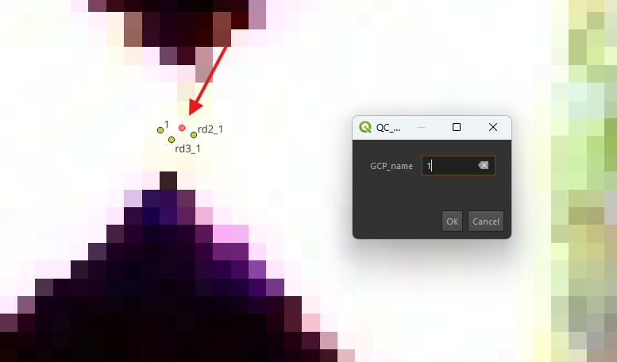
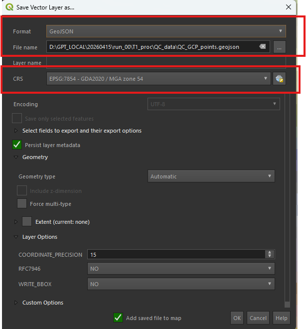

# APPN – Aerial Data QC Protocols


> [!NOTE]
> This document describes procedures for measuring the uncertainty of drone
> flights. Initially this document focuses on the
> hyperspectral drones, but the procedure will expand in the future.
> It will also form the basis of a standard QC procedure for future flights.

> [!NOTE]
> The QC procedures in this document are tightly coupled to the APPN flight
> designs — the panels, ground control points, and reflectance targets that
> the QC steps rely on are deployed *during* the flight itself. Before
> performing any QC, make sure you understand which targets were placed in
> the field by reading the relevant flight protocol:
>
> - [Standard Flight](../../FlightDesign/StandardFlight/Standard_Flight.md)
>   — routine APPN data-collection flight; defines the baseline panel and
>   GCP layout used for ELM and positional QC.
> - [Validation Flight](../../FlightDesign/ValidationFlight/Validation_Flight.md)
>   — extended flight that adds additional validation panels, GCPs, and
>   (in future) LiDAR calibration targets used by the spectral, positional,
>   and LiDAR QC sections below.

## Document Structure

The conventions in [General QC Conventions](#general-qc-conventions) apply to
**all** QC processes below. Read that section first, then jump to the
specific QC type you need:

- [General QC Conventions](#general-qc-conventions)
  - [File Format — GeoJSON vs Shapefile](#file-format--geojson-vs-shapefile)
  - [Naming Conventions](#naming-conventions)
  - [File Storage](#file-storage)
- [Positional QC](#positional-qc)
- [Spectral QC](#spectral-qc)
  - [Creating Geospatial Vector Data — GOBI & CALViS (QGIS)](#creating-geospatial-vector-data--gobi--calvis-qgis)
  - [Extracting Pixels into a Table](#extracting-pixels-into-a-table)
- [LiDAR QC](#lidar-qc)

---

## General QC Conventions

These file-format, naming, and storage rules apply to every QC process
(positional, spectral, LiDAR) described later in this document.

### File Format — GeoJSON vs Shapefile

> [!IMPORTANT]
> **GeoJSON (`.geojson`) is the preferred format** for all QC vector data,
> though shapefiles (`.shp`) are also supported by the QA code at
> <https://github.com/ArdenB/APPN_GenricFileStorage>.
>
> GeoJSON is preferred because:
>
> - It is a **single self-contained file**, rather than the 4–6 sidecar files
>   (`.shp`, `.shx`, `.dbf`, `.prj`, `.cpg`, …) required by the shapefile
>   format. This makes it easier to copy, share, and store without losing
>   pieces.
> - It is **plain-text JSON**, so it is human-readable, diff-friendly, and
>   works cleanly with Git version control.
> - It is an **open, web-native standard** (RFC 7946) supported by virtually
>   all modern GIS tools, web mappers, and Python/R libraries.
> - CRS handling is explicit: the default GeoJSON specification (RFC 7946)
>   only supports WGS84 (EPSG:4326), but all major GIS software (QGIS,
>   ArcGIS, GDAL, geopandas, etc.) allow you to specify and read a different
>   CRS when writing/reading the file. For APPN QC work we **keep the file
>   in the same projected CRS as the source orthomosaic** (e.g. GDA2020 /
>   MGA zone XX) rather than reprojecting to WGS84.
> - It has **no field-name length limit** (shapefile DBF caps at 10
>   characters) and no 2 GB file-size cap.
>
> If you already have shapefiles, you do **not** need to re-create them —
> the QA pipeline will read either format. New files should be saved as
> `.geojson`.

### Naming Conventions

| Name                                    | Overview                                                                                                                  |
| --------------------------------------- | ------------------------------------------------------------------------------------------------------------------------- |
| `QC_ELM_Panels.geojson`                 | Polygons of the reflectance panels used in the ELM during GRYFN Processing.                                               |
| `QC_VAL_Grfyn_Panels.geojson`           | When a second set of GRYFN panels is placed in the field. Replace *ELM* with *VAL* for validation.                        |
| `QC_VAL_{PanelName}_Panels.geojson`     | Any future validation panels or tests of other panels. Replace `{PanelName}` with the name or unique identifier.          |
| `QC_GCP_points.geojson`                 | If alternative GCP points (e.g. Aeropoints) are placed in the field. Points-only file; points should match panel centres. |
| `QC_LIDAR_{TargetName}_Surface.geojson` | Name for any future LiDAR calibration surfaces.                                                                           |

> [!TIP]
> Any additional information (e.g. date) can be added to the end of the file
> name with an underscore — e.g. `QC_ELM_Panels_20260302.geojson`. This
> table will be updated if we source panels other than GRYFN. Shapefile
> equivalents (e.g. `QC_ELM_Panels.shp`) are also accepted by the QA code.

### File Storage

Any files created in the quality control steps are to be stored in a newly
created `QC_data` folder inside `T1_proc`, following the
[APPN folder structure](https://github.com/ArdenB/APPN_GenricFileStorage/wiki/Folder-Structure).

Formal path:

```
./{Node}/
  {YYYY_ProjectDesc[_I|E][_Researcher][_org]}/
  {YYYYSiteName[_F|C]}/
  {SensorPlatform}/{YYYYMMDD}/run_XX/T1_proc/QC_data/
```

Example:

```
./USYD_Narrabri/2025_SIFCal/2025IAWatson_F/CALVIS/20250825/run_00/T1_proc/QC_data/
```

These vector files (GeoJSON preferred, shapefile accepted) are meant to be
created after the GPRO has been completed. The APPN storage repo has been
updated to include this folder:
<https://github.com/ArdenB/APPN_GenricFileStorage>

---

## Positional QC

> [!WARNING]
> This section is still a work in progress.

> [!IMPORTANT]
> Positional QC **must be performed immediately after processing is complete**
> (e.g. straight after GPRO creation). Positional errors are often the first
> indication of a larger problem with the flight or the processing pipeline,
> and almost always require the data to be reprocessed before they can be
> resolved. Catching them early avoids wasted downstream work.

APPN Positional QC is performed in three stages:

1. **[Field Data Collection](#field-data-collection)**
2. **[Observed point capture](#observed-point-capture)**
3. **[Accuracy reporting](#accuracy-reporting)**

> The descriptions below show the procedure for the CALViS using GCPs. The
> process for the GOBI is the same, but there is only the VNIR orthomosaic.
> The same workflow can be used to produce shapefiles if preferred — just
> choose *ESRI Shapefile* in place of *GeoJSON* in the format dropdown.

For the CALViS, in the products folder of the completed GPRO you will find the
`.tif` files:

- `X__VNIR_Orthomosaic.rgb`
- `X_SWIR_Orthomosaic.rgb`

These are the RGB bands from the VNIR and SWIR files respectively. They can be
easier to use than the full `.bin` files, though the procedure is the same.

### Field Data Collection

> [!IMPORTANT]
> **TODO:** Name and details pending.

Independent GCPs are placed in the field during data capture (see
[Standard Flight](../../FlightDesign/StandardFlight) and
[Validation Flight](../../FlightDesign/ValidationFlight)). These GCPs are
independent of any points used during processing so they provide an unbiased
check.


The raw data from the GCP points should be saved in the `T0_raw/Vault` folder
(location may change).

   Formal path:

   ```
   ./{Node}/
     {YYYY_ProjectDesc[_I|E][_Researcher][_org]}/
     {YYYYSiteName[_F|C]}/
     {SensorPlatform}/{YYYYMMDD}/run_XX/T0_raw/Vault/
   ```

   Example:

   ```
   ./USYD_Narrabri/2025_SIFCal/2025IAWatson/CALVIS/20250825/run_00/T0_raw/Vault/
   ```

This data should then be convereted into the APPN standard format (geojson
with `ID`, X, Y, Z, CRS). The exact process for doing this will depend on the
exact GCP used (Aeropoint, Trimble, etc).

> [!IMPORTANT]
> **TODO:** Document the conversion process for each supported GCP type
> (Aeropoint, Trimble, …).

There are some common issues:
- missmatched CRS between GCP coleection and data procesing. 
- incorrect height data format e.g. GDA2020 ellipsoid and the Australian
  Height Datum (AHD) — see Geoscience Australia's
  [AUSGeoid2020 conversion tool](https://geodesyapps.ga.gov.au/ausgeoid2020)
  for converting between ellipsoidal and AHD heights.
- inconsistent ID names or duplicate points. Fix and remove.

Once all the issues are fixed. The document should be saved as __TODO:

   Formal path:

   ```
   ./{Node}/
     {YYYY_ProjectDesc[_I|E][_Researcher][_org]}/
     {YYYYSiteName[_F|C]}/
     {SensorPlatform}/{YYYYMMDD}/run_XX/T1_proc/QC_data/QC_TODO:.geojson
   ```

   Example:

   ```
   ./USYD_Narrabri/2025_SIFCal/2025IAWatson/CALVIS/20250825/run_00/T1_proc/QC_data/QC_TODO:.geojson
   ```


### Observed point capture

Manually digitise a matched set of points from the drone orthomosaic in QGIS
and save them as `QC_GCP_points.geojson` (see
[Naming Conventions](#naming-conventions)). The `GCP_name` column must match
the names used in the field data.

#### 1. Load the Data

1. Load the SWIR and VNIR files into QGIS and run the following checks:
   - Do the panels in the SWIR and VNIR overlap?
   - Make note of the CRS.

   

   *Figure: The VNIR is set to 50% opacity to confirm the panels overlap with the
SWIR. The information panel is open on the SWIR to confirm the CRS (EPSG:7855
– GDA2020 / MGA zone 54). This CRS is for Roseworthy SA where this CALViS
flight was collected.*

Instead of transperency you can also turn one image on and off to confirm overlap is aceptable.

If overlap is fine:

 2. Load the ground truth GPS data for your GCPs. Note that the ground truth data is loaded to making naming the annotations on the GRYFN data easier.


   

Here, is an example of the ground truth data points over the GCP from the CALVIS 
   

#### 2. Create the Shapefile
 
1. Navigate to **Layer → Create Layer → New Shapefile Layer**.

The file name will be QC_GCP_points, Geomtry type is "points" and for field we delete the existing "ID" and replace it with GCP_name (Note: use Type "Text(string)")
 

2. Set the **File Name** to `QC_GCP_points.shp` 

3. Set the **Geometry type** to *points*.

4. Set the **CRS** to match your dataset.

5. Add a single field — `GCP_name`:
   - Select the pre-filled `id` field in the Fields list and click
     **Remove Field** (bottom right) to remove it.
   - Set `GCP_name` as an **Text(string)** 

#### 3. Annotating the GCPs   

To start annotating the GRYFN data: 
1. Select `QC_GCP_points` in the **Layers** menu.
2. Click the pencil icon (**Toggle Editing**).
3. Click the points (**Add point feature**)



4. Navigate to the centre of the GCP, left click and name the GCP appropriatly (the name needs to match your ground truth data). In the figure below the ground truth data is in Green and the Red dot is GRYFNS accuracy. 




Do this for all relevent GCPs.

#### 5. Save the data as a GeoJSON

1. Right-click `QC_GCP_points` in the **Layers** menu → **Export → Save
   Features As**.

2. The presets are fine — just make sure the **File Name** is correct and in
   the right folder (click the three dots to navigate). Make sure **Format** is GeoJSON and double-check the
   **CRS**.



### Accuracy reporting

Run the QA code at
<https://github.com/ArdenB/APPN_GenricFileStorage>
(`Code/DS02_DatasetQA/`) to generate a spatial accuracy report comparing the
observed (drone) and reference (surveyed) GCP locations. The report produces
per-point residuals and overall RMSE in X, Y, and Z.

> [!IMPORTANT]
> **TODO:** Write this section and include lots of info.


---

## Spectral QC

Spectral QC is done by drawing polygons in GIS software over surfaces with
known spectral values, then extracting and comparing them. This is done after
all processing in software like GPT is complete.

CALViS and GOBI flights conducted prior to the *Operational Excellence in APPN
Hyperspectral Imaging* SIF likely consist of one GRYFN reflectance panel
(used to generate the ELM in the GRYFN Processing Tool) along with additional
panels for validation.

File naming, format (GeoJSON preferred), and storage location for the
polygons created below all follow the
[General QC Conventions](#general-qc-conventions) above.

### Creating Geospatial Vector Data — GOBI & CALViS (QGIS)

> The description below shows the procedure for creating GeoJSON files for the
>  CALViS using GRYFN reflectance panels for ELM. The process for the GOBI is
>  the same, but there is only the VNIR orthomosaic. The same workflow can be
>  used to produce shapefiles if preferred — just choose *ESRI Shapefile* in
>  place of *GeoJSON* in the format dropdown.

For the CALViS, in the products folder of the completed GPRO you will find the
`.tif` files:

- `X__VNIR_Orthomosaic.rgb`
- `X_calvis_sif_cal_20250925_SWIR_Orthomosaic.rgb`

These are the RGB bands from the VNIR and SWIR files respectively. They can be
easier to use than the full `.bin` files, though the procedure is the same.

#### 1. Load the Data

1. Load both files into QGIS and run the following checks:
   - Do the panels in the SWIR and VNIR overlap?
   - Make note of the CRS.


*Figure: The VNIR is set to 50% opacity to confirm the panels overlap with the
SWIR. The information panel is open on the SWIR to confirm the CRS (EPSG:7855
– GDA2020 / MGA zone 55). This CRS is for Narrabri NSW where this CALViS
flight was collected.*

#### 2. Create the Vector Layer

> [!IMPORTANT]
> **TODO:** Richard please check and update this section.


1. Navigate to **Layer → Create Layer → New GeoPackage Layer…** for GeoJSON
   output, or **New Shapefile Layer…** if producing a shapefile. Either way
   you will set the output **File Name** with the appropriate extension
   (`.geojson` preferred, `.shp` accepted).

   

   > [!TIP]
   > To save directly as GeoJSON you can also create a temporary scratch
   > layer and then **Export → Save Features As… → GeoJSON** in step 5.

2. Set the **File Name** to `QC_ELM_Panels.geojson` (see the
   [naming conventions](#naming-conventions) table for the correct name given
   your use case).
3. Set the **Geometry type** to *Polygon*.
4. Set the **CRS** to match your dataset.
5. Add a single field — `Panel_ref`:
   - Select the pre-filled `id` field in the Fields list and click
     **Remove Field** (bottom right) to remove it.
   - Set `Panel_ref` as an **Integer** between 0–100. It is the percentage
     reflectance (e.g. 11, 30, 56, 82 for GRYFN panels).

   > [!IMPORTANT]
   > You need to click **Add to Fields List** once you populate "New Field".

   

#### 3. Draw Boxes over the Panels

The boxes should be polygons drawn inside the panel. The points should be
drawn to cover as much of the panel as possible without including edge effects
(2–3 pixels from the edge of the panel). If there are gaps or missing values
within the panel, they should be included.

1. Select `QC_ELM_Panels` in the **Layers** menu.
2. Click the pencil icon (**Toggle Editing**).

   

3. Click **Add Polygon Feature**
   .
4. Click four points around a specific reflectance panel, then right-click to
   close the polygon. Repeat for all panels (e.g. 11, 30, 56, 82).

   

#### 4. Sanity Check Labels

1. Double-click `QC_ELM_Panels` in the **Layers** menu.
2. In **Layer Properties**, click **Labels** and select **Single Labels**.

   

#### 5. Save the File

1. Right-click `QC_ELM_Panels` in the **Layers** menu → **Export → Save
   Features As**.

   

2. Set the **Format** to *GeoJSON* (preferred) — or *ESRI Shapefile* if
   required. Make sure the **File Name** is correct and in the right folder
   (click the three dots to navigate). Double-check the **CRS**.

   

### Extracting Pixels into a Table

Arden Burrell has made a Python script that can go through the APPN standard
folder structure, extract the values into a table, and save that as a `.csv`
or `.parquet` file automatically. The code is available from:

<https://github.com/ArdenB/APPN_GenricFileStorage>

- **Script:** `Code/DS02_DatasetQA/QA00_ELMvaliditation.py`
- **README:** `Code/DS02_DatasetQA/README.md`

If nodes choose to extract the points using other means, the tables should
have the following columns:

```
band, wavelength, value, Panel_ref, node, project, site, sensor, date, run, panel_name, type, gpro_nu
```

---


## LiDAR QC

> [!WARNING]
> This section is still a work in progress.

