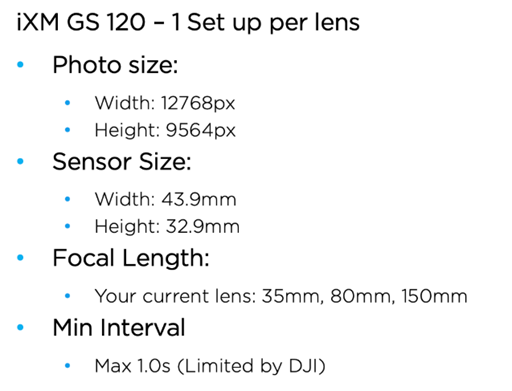
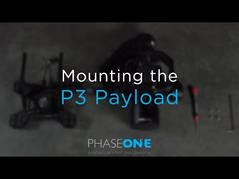
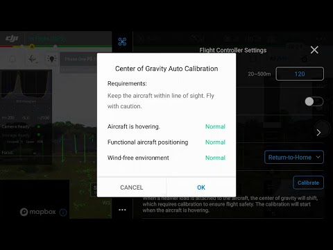

# APPN – Hi-Res Fieldbook

For a high-level description of the Hi-Res sensor package and how it sits
alongside the other APPN platforms, see the
[Platforms Overview](../../Background/PlatformsOverview/Platforms_Overview.md).

This fieldbook provides a standardised operational guide for APPN Hi-Res UAV
deployments using the Phase One iXM-GS120 120 MP RGB camera mounted on a DJI
M350 RTK. It is intended for trained APPN staff conducting high-resolution RGB
data acquisition for crop emergence, canopy architecture, and structural
phenotyping applications. The protocol supports safe flight operations,
consistent sensor configuration, and high-quality, repeatable data capture
across APPN field nodes.

> [!IMPORTANT]
> **This protocol must be followed for all standard APPN Hi-Res UAV flights.**
> Adherence to these procedures is essential to ensure operational safety, data
> integrity, and comparability of datasets across deployments. For any flights
> that **fall outside standard operating procedures**, detailed records must be
> kept documenting all deviations, including the specific settings changed, the
> rationale for those changes, and any anticipated implications for data
> quality or analysis.

---

## Document Structure

1. [Equipment Checklist](#equipment-checklist) — what to bring to the field.
2. [First Use and Preseason Preparation](#first-use-and-preseason-preparation) —
   pre-deployment commissioning of the camera, gimbal, and aircraft.
3. [Preflight Planning](#preflight-planning) — area of interest, KML
   creation, and DJI Pilot 2 mission setup.
4. [APPN Hi-Res Mission Standard Types](#appn-hi-res-mission-standard-types) —
   Table 1 standard mission bundles.
5. [Camera Capture Settings](#camera-capture-settings) — aperture, shutter,
   ISO, focus, and white balance.
6. [Onsite Preflight Operations](#onsite-preflight-operations) — weather
   and airspace checks, GCP layout, payload mount, and aircraft setup.
7. [Flight Operations](#flight-operations) — takeoff, autonomous mission,
   and landing.
8. [In-Flight Data Confirmation](#in-flight-data-confirmation) — image
   count, exposure, and storage checks.
9. [Post-Flight](#post-flight) — pack-down of aircraft, payload, and
   ground reference kit.
10. [Offload Data](#offload-data) — downloading from the camera and
    storing under the APPN folder structure.
11. [Sensor Configuration Reference](#sensor-configuration-reference) —
    Table 2 consolidated mission, camera, and environmental settings.
12. [GSD vs Altitude Lookup](#gsd-vs-altitude-lookup) — Table 3 ground
    sampling distance reference.
13. [Shutter Speed Lookup](#shutter-speed-lookup) — Table 4 minimum
    shutter speed by altitude and ground speed.
14. [Non-Routine, First-Time, and Commissioning Procedures](#non-routine-first-time-and-commissioning-procedures) —
    damping plate, iX Capture, gimbal balancing, CoG calibration, and
    custom camera setup.

---

## Equipment Checklist

> [!NOTE]
> Ensure batteries for all equipment are fully charged before heading to the
> field. Ensure charging cables are available for necessary equipment.

- [ ] **Aircraft**
  - [ ] DJI M350 (with P3 gimbal damping plate attached)
  - [ ] Aircraft batteries and spares
  - [ ] Landing gear
  - [ ] Landing pad
  - [ ] Spare parts
  - [ ] Tools
  - [ ] Logbook
- [ ] **Radio Control Transmitter / Ground Control Station**
- [ ] **Hi-Res sensor payload**
  - [ ] Phase One iXM-GS120 camera body and P3 gimbal
  - [ ] 80 mm lens
  - [ ] Camera storage media (CFexpress) and card reader
- [ ] **Ground reference kit**
  - [ ] DJI D-RTK 2 base station, tripod and spare batteries
  - [ ] Ground control points
  - [ ] GNSS system (Emlid / Trimble)
  - [ ] Wooden base station peg with marked centre-point (optional — for
        when returning to a location for surveys through time, or for
        linking to real-world GNSS data)
- [ ] **Accessories**
  - [ ] Safety gear (signage and high-vis vests)
  - [ ] Aeronautical radio
  - [ ] Field laptop and spare batteries
  - [ ] External storage media
  - [ ] Water, food, esky, sunscreen, bug spray, first aid kit, etc.
  - [ ] Spirit bubble, spirit level (or angle measurement) and measuring tape
  - [ ] External power brick (for charging UAV RC)
  - [ ] Handheld anemometer (such as a [Kestrel](https://kestrelmeters.com.au/))
  - [ ] Professional lens cleaning wipes

---

## First Use and Preseason Preparation

> [!IMPORTANT]
> Performance of the camera relies on correct installation of the Phase One
> camera within the gimbal, a perfectly balanced gimbal, and the drone
> performs best when the camera weight and centre of gravity has been
> factored into the DJI flight control software.
>
> Please refer to
> [Non-Routine, First-Time, and Commissioning Procedures](#non-routine-first-time-and-commissioning-procedures)
> at the end of this document for information on installing the damper
> plate, gimbal installation and setup, gimbal balancing, and drone centre
> of gravity balancing.

> [!NOTE]
> Once you have set the gimbal balance, note the settings and offsets and
> take photos of the setting locations to ensure you have reference settings
> for a stable gimbal. If the camera and gimbal go out of balance,
> immediately inspect the balance settings and reset them to the known
> default balanced values for that camera.

---

## Preflight Planning

> [!IMPORTANT]
> Ensure that you apply for UAV flight approvals for locations and dates of
> flights well in advance. Further planning documentation for the Phase One
> payload on the M350 can be found in the
> [Phase One iX Cameras on DJI M300 with P3 Gimbal Installation Guide](https://www.phaseone.com/wp-content/uploads/2022/05/Phase-One-iX-Cameras-on-DJI-M300-with-P3-Gimbal-Installation-Guide-Rev-1.0.4.pdf).
> Note that before first flight with this sensor, several commissioning steps
> must be completed — see
> [Non-Routine, First-Time, and Commissioning Procedures](#non-routine-first-time-and-commissioning-procedures).

1. Using a GPS survey system (Emlid, Trimble…) or GIS software, create a
   polygon of the area of interest. Make sure your polygon includes the
   areas where you will place your GCPs, with an additional 5 m buffer to
   avoid incomplete data.
2. Save the polygon as a KML file using the convention
   `YYYYMMDD_XXXX` (`YYYY` = year; `MM` = month; `DD` = day, must be
   2 digits; `XXXX` = a short reference or abbreviation for the job).
3. Load the KML file onto a USB stick or microSD card for transfer to the
   M350 controller.
4. Power on the controller.
5. Open DJI Pilot 2 and select **Flight Route → + Import Route (KMZ/KML)**.
   Alternatively, you can create an Area Route on the controller (e.g. by
   walking the field). *Note that you do not need the UAV powered on for
   this — just the controller.*
6. Confirm that the Phase One iXM-GS120 payload is correctly detected in
   DJI Pilot 2 and selected as the active payload for the mapping mission.
   Ensure the correct aircraft model (M350 / M300 RTK) is selected, and
   configure a custom camera profile using the appropriate Phase One P3
   (80 mm) parameters.

   

   > [!NOTE]
   > **[NC1]** Does this happen automatically — do we need the custom
   > settings? Also ensure that we list (and ideally include a screenshot
   > of) the specific camera, as we previously had an issue specifying the
   > incorrect camera which then resulted in the wrong overlap and GSD
   > settings.

7. Set the flight altitude mode to **Relative to Take-off Point**.
8. Set image overlap and triggering parameters in the **Advanced Settings**
   of the mapping mission:
   - Front (forward) overlap: **80%**
   - Side (lateral) overlap: **80%**
   - Photo mode: **Distance Interval Shot**

   > [!NOTE]
   > **[NC2]** Retain these overlap values for now. If we move to a
   > non-photogrammetry processing pathway, this could be reduced a fair
   > bit.

9. Set the course angle to align with the experimental layout:
   - Use **row-aligned** orientation for plot-based trials where crop rows
     are clearly defined.
   - Use **North–South** orientation for broad-scale paddock surveys.
10. Select the flight altitude and associated ground sampling distance
    (GSD) and flight speed according to the mission standard type settings
    in [Table 1 — APPN Hi-Res Mission Standard Types](#appn-hi-res-mission-standard-types).
    These bundles are optimised to balance spatial resolution, coverage, and
    motion-blur risk. The chosen altitude must be documented in the flight
    log.

    > [!NOTE]
    > **[NC3]** Repeats the altitude-mode step above.
    >
    > **[NC4]** What flight log?
    >
    > **[CC5]** I think this is just a USyd requirement — could likely be
    > deleted.

11. Disable **Elevation Optimisation** for standard agricultural surveys
    unless operating in highly variable terrain.

    > [!NOTE]
    > **[NC8]** Do we need to cover going into the camera settings here
    > and setting at this point?

12. Use the [Phase One flight calculator](https://flightcalculator.phaseone.com/)
    to optimise flight speed whilst minimising blur. This may need to be
    changed on site if lighting conditions require longer exposures.

    > [!NOTE]
    > **[NC9]** Becomes redundant when setting the standard types — we
    > should let ISO compensate, and adjust speed only in low light.

13. Save the mission using the convention `YYYYMMDD_XXXX` (as above).

---

## APPN Hi-Res Mission Standard Types

*Table 1 — APPN Hi-Res Mission Standard Type settings.*

Pre-tuned parameter bundles for the four APPN Hi-Res Mission Standard Types.
Flight parameters must match the application and must not deviate from these
settings. Validate shutter speed and flight speed (to ensure no motion blur)
against [Table 4 — Shutter Speed Lookup](#shutter-speed-lookup) for the
specific speed you select.

> [!NOTE]
> **[NC6]** I am proposing this becomes the master reference for flight
> settings.

| Standard Mission Type | Scenario                                                                                       | Altitude   | Speed     | Shutter   | Aperture | Overlap |
| :-------------------- | :--------------------------------------------------------------------------------------------- | :--------- | :-------- | :-------- | :------- | :------ |
| **Type 1**            | Plant counting / small structures (flowers, heads, early lesions, emergence counting)          | 12–20 m    | 2–3 m/s   | ≥ 1/4700  | f/8      | 80/80   |
| **Type 2**            | Plot phenotyping (canopy traits, vigour)                                                       | 30–50 m    | 4–5 m/s   | ≥ 1/4700  | f/8      | 80/80   |
| **Type 3**            | Canopy coverage / plot averages                                                                | 50–70 m    | 5–7 m/s   | ≥ 1/4700  | f/8      | 80/80   |
| **Type 4**            | Large-area flat terrain ortho (efficiency mode)                                                | 80–120 m   | 8–10 m/s  | ≥ 1/5200  | f/8      | 80/80   |

> [!NOTE]
> **[NC7]** My sense for Type 1 is to standardise to 12 m only — not a
> range.

---

## Camera Capture Settings

Press the camera image icon in DJI Pilot 2 and configure the camera
appropriate to your APPN Hi-Res Mission Standard Type. For full per-parameter
guidance, see [Sensor Configuration Reference (Table 2)](#sensor-configuration-reference).

1. **Aperture** — set to a fixed value of **f/8**.
2. **Shutter speed** — set per [Table 1](#appn-hi-res-mission-standard-types)
   and validate against [Table 4](#shutter-speed-lookup). As a general rule,
   never use a shutter speed slower than **1/2000 s** (this will result in
   motion blur).
3. **Focus** — set to **infinity**.

   > [!NOTE]
   > **[NC10]** Comment from Dan is relevant here — need to check that for
   > a 12 m flight we are OK at infinity manual focus.
   >
   > **[NC11]** We may need to consider moving to autofocus and then a
   > setting that gets heads in focus.
   >
   > **[NC12]** Is there a way to glue or disable to infinity to stop this
   > moving? Has been an issue on other cameras with a fixed, manual focus.
   >
   > **[DS15]** I haven't operated the Phase One directly, so I can't speak
   > to the specifics, but focus settings are worth considering. In
   > particular, ensure the camera is focused on the plane of interest —
   > for example, if counting sorghum heads, focus should be set at head
   > height rather than the ground. With tall crops, depth of field can
   > be enough to render your target slightly out of focus.

4. **ISO range** — Min: **200** / Max: **3200**. ISO is the only exposure
   value that should adjust automatically during the mission, depending on
   light conditions.
5. Display the **live histogram** and confirm there is no sustained clipping
   in the highlights or shadows. Do **not** use any **EV compensation
   (+/-)** — allow ISO to adjust automatically within the configured range.
6. **White balance** — fixed to **Sunny / 5500 K** (apply this setting in
   all light conditions).
7. Before take-off, **test-fire the camera** (from the DJI Pilot 2 app and
   M350 Controller) and confirm that the image is written successfully to
   the storage media.
8. Ensure any legacy data has been downloaded and backed up. Format the
   memory card from the DJI Pilot 2 app menus within the M350 Controller.
9. Before starting the mission, manually fly to the planned operating
   altitude with the camera pointing down at the crop / plants. Confirm
   that the live preview and histogram show correct exposure.

> [!NOTE]
> For more information on flight settings and what they do, refer to
> [Sensor Configuration Reference (Table 2)](#sensor-configuration-reference).

---

## Onsite Preflight Operations

1. Conduct airspace and weather checks.
   - Check NOTAM (find in [ERSA](https://www.airservicesaustralia.com/aip/aip.asp)).
   - Ideally, no cloud cover. Avoid rapidly changing cloud conditions where
     possible.
   - Maximum wind speed for quality capture is **6 m/s (22 km/h)**. Any
     wind speed over **5 m/s (18 km/h)** should be recorded.
   - Do not operate in conditions below 0 °C or above 40 °C.

   > [!NOTE]
   > **[NC13]** Where, how, and how is this then propagated through as
   > metadata? Unless it can be captured as metadata, there is no point
   > recording it.

2. Turn on the aeronautical radio and set to local CTAF (find in
   [ERSA](https://www.airservicesaustralia.com/aip/aip.asp)).
3. Set up the DJI D-RTK 2 base station on a tripod and power on at least
   15 minutes prior to flight. Ensure it is set up in **operation mode 5**
   (five LED blinks for communication with the M350).

   For any missions returning to the same location or requiring alignment
   to non-DJI data, the DJI D-RTK 2 base station must be set up over a
   known point that is surveyed against a GNSS base station (e.g. using
   AUSCORS or AUSPOS), or set to the location used for a previous survey.
   In the M350 controller RTK settings, manually edit the latitude and
   longitude of the base station to the known surveyed (or past) location.
   The aircraft should be switched off during this step.

   > [!NOTE]
   > **[NC14]** Do we need to consider setting this up on a standard
   > point? This will become increasingly important for the non-GCP
   > photogrammetry methods.
   >
   > Best practice will be to survey in a point that is referenced to a
   > GNSS station, then set the DJI D-RTK 2 to this specific lat/long
   > location — otherwise the real-world error will be 3–5 m.

4. Deploy GCPs in the field, ensuring good coverage of the area of
   interest. If using Propeller Aeropoints, ensure they are switched on
   and logging. If using standard GCPs, log GNSS coordinates using a
   Trimble or Emlid GNSS system.
5. Set up the landing pad and UAV in a safe RTH location.
   - In dusty environments an additional tarp should be used under the
     landing pad.
6. Attach the Hi-Res payload to the UAV:
   - Check that the lens and sensors are clean. If not, use professional
     lens cleaning wipes to clean them.
   - Check the damping plate to ensure it is mounted securely to the UAV
     and that the USB-C cable is connected.
   - Remove the protective metal cap from the quick-release receptacle.
   - Insert the gimbal into the quick-release receptacle on the damping
     plate, aligning the unlocked symbol on the bayonet opposite the white
     mark on the receptacle.
   - Rotate the non-slip ring to the right until the locked symbol is
     opposite the white mark on the receptacle and the bayonet clicks and
     locks. *Note: this mount is tool-less, but correct alignment is
     critical.*
   - **Remove the lens cap.**
   - Ensure the CFexpress card is installed and that there is adequate
     space to store mission data.
7. Power on the radio controller; check battery status.
8. Launch DJI Pilot 2.
9. Load and review the flight plan, checking operational height and
   double-checking that the area of interest, GCPs, and reflectance panels
   are all within the capture polygon.
10. Power on the aircraft; confirm connection to RC/GCS and battery status.
11. On the controller, set up a safe UAV RTH location, RTH altitude, and
    other geo-fencing settings. Check that the mission is available on
    the controller.
12. If you are using RTK, check that you are receiving GNSS corrections.
    There should be more than 8 satellites for good correction. Check the
    RTK resolution in the M350 controller settings — the solution should
    be **FIX** with horizontal and vertical error less than **0.03 m
    (3 cm)**.

---

## Flight Operations

1. Ensure the aircraft is in **Position** flight mode.
2. Clear people / objects away from the UAV.
3. Notify crew / observers that takeoff is beginning.
4. Begin manual takeoff, fly quickly to ~12 m AGL, and check stick
   controls work.
5. Enable the autonomous mission prepared earlier.
6. Monitor UAV battery voltage / percentage in flight.
7. After mission, switch back to **Position** mode to regain manual
   control.
8. Land and disarm the UAV.
9. Leave the UAV, transmitter, and sensor powered on; begin post-flight
   checks.

---

## In-Flight Data Confirmation

1. On the RC Plus controller, check image count and remaining storage on
   the card (to ensure the card did not fill up during the mission).
   Review the images as the mission proceeds. Ensure that the image count
   is increasing as images are written to the card. Listen for the “click”
   noise as images are captured. Review the histogram settings and the
   photos to ensure that images have appropriate illumination.

---

## Post-Flight

1. Power off the drone, then the controller.
2. Inspect the drone for any damage and report for maintenance if
   necessary. Feel both batteries for excess or differential temperature.
   Feel the gimbal motors for excess or differential temperature. Inspect
   propellers, airframe, and landing gear.
3. Remove aircraft batteries.
4. Remove the payload and place it in its case.
5. Pack up the drone and all gear from site, double-checking against the
   checklist at the start of this document to ensure everything is
   accounted for.

---

## Offload Data

1. Remove the CFexpress card from the camera and offload data to a
   computer using a card reader.
2. After offload and backup, format the card for the next mission.

   > [!NOTE]
   > **[NC16]** I would only format in the controller.

---

## Sensor Configuration Reference

*Table 2 — Consolidated mission, airframe, camera, and workflow settings.*
All values assume the **80 mm AF lens** on the **iXM-GS120** body;
substituting any other lens or camera body invalidates the GSD column in
[Table 3](#gsd-vs-altitude-lookup) and requires re-calculation.

### Mission type & route setup (DJI Pilot 2 — Mapping)

| Parameter                    | Recommended setting                                                                                | Operational note                                                                                                                                |
| :--------------------------- | :------------------------------------------------------------------------------------------------- | :---------------------------------------------------------------------------------------------------------------------------------------------- |
| **Mission Type**             | Area Route — Ortho Collection                                                                      | Use the dedicated Ortho Collection template. Do not use Oblique Collection for orthomosaic output.                                              |
| **Ortho GSD (cm/pixel)**     | Leave default — auto-populates from Route Altitude                                                 | Altitude drives GSD via the Phase One sensor geometry.                                                                                          |
| **Altitude Mode**            | Relative to Takeoff Point (ALT)                                                                    | Assumes takeoff elevation ≈ site elevation.                                                                                                     |
| **Route Altitude (m)**       | Select from [Table 3](#gsd-vs-altitude-lookup) — tailor to mission objective                       | Counting plant organs / flowers / heads → lowest practical altitude (12–20 m). Canopy coverage / plot averages → 50–120 m.                      |
| **Elevation Optimisation**   | DISABLED                                                                                           | Do not enable for ortho missions — can cause alignment issues in Metashape.                                                                     |
| **Speed (m/s)**              | As fast as mission allows (recommended 3–10 m/s max); cross-check with [Table 4](#shutter-speed-lookup) | Motion blur = shutter interval (s) × drone speed (m/s). **Rule: motion blur ≤ GSD.** See worked example below.                              |
| **Frontal & Side Overlap**   | 80 / 80 (default, high-quality ortho)                                                              | 80/80 is the true-ortho setting — minimises lean, best for crop / plant-structure work.                                                         |
| **Route Start Point**        | Furthest polygon corner from pilot                                                                 | Mission works back toward the pilot, finishing closest to the takeoff point. Reduces return-transit risk if battery runs low.                   |
| **Takeoff Speed (m/s)**      | 10–15                                                                                              | Transit-only speed (takeoff point → first waypoint). Safe to run faster than capture speed because no images are triggered in transit.          |

> [!TIP]
> **Worked example — 50 m altitude, 4 m/s, 1/4000 s:**
>
> - Shutter interval: 1 ÷ 4000 = **0.00025 s**
> - Drone speed: **4 m/s**
> - Motion blur: 0.00025 × 4 = **0.001 m** = **1.0 mm**
> - GSD at 50 m: **2.1 mm** = 0.0021 m
> - Check: 1.0 mm ≤ 2.1 mm ✓ **Pass** (blur is ~½ pixel — ideal).

### Phase One iXM-GS120 (80 mm AF lens) — camera capture settings

| Parameter                     | Recommended setting                                                                                | Operational note                                                                                                                                                                              |
| :---------------------------- | :------------------------------------------------------------------------------------------------- | :-------------------------------------------------------------------------------------------------------------------------------------------------------------------------------------------- |
| **Exposure Mode**             | Manual (fixed aperture + fixed shutter + auto ISO)                                                 | Lock shutter (1/2000 or faster — see [Table 4](#shutter-speed-lookup)), set aperture to f/8, let ISO adjust. Protects motion-blur ceiling first, radiometric quality second.                  |
| **EV Compensation**           | 0 baseline — adjust to +1 in low-light / emergence conditions                                      | +1 EV pushes the histogram right for more tonal information. Verify with live histogram.                                                                                                      |
| **ISO**                       | Base 200 (sensor native) — max 3200                                                                | iXM-GS120 native ISO range is 200–6400 (RGB). Noise becomes visibly detectable above ISO 3200.                                                                                                |
| **Aperture**                  | f/8 min (sweet spot) — f/11 max                                                                    | Sharpness peaks ~f/8 across the frame; edge softness appears wide of f/5.6 and diffraction softens past f/11.                                                                                 |
| **Shutter Speed**             | Set per [Table 4](#shutter-speed-lookup) — from 1/2000 to 1/16,000                                 | Motion blur rule: shutter × speed ≤ GSD × 0.5 (half-pixel tolerance).                                                                                                                         |
| **Focus Mode**                | Manual focus locked to infinity (> 3 m) **or** AF (single acquisition at mission start)            | A calibrated fixed-focus 80 mm (infinity-only) achieves ±2 px RMSE vs. higher residuals on an uncalibrated AF. For research-critical work, consider requesting the fixed 80 mm.               |
| **Focus Bracketing**          | OFF                                                                                                | Bracketing multiplies frame count and breaks consistent GSD assumptions for ortho processing.                                                                                                 |
| **White Balance**             | Fixed to Daylight (5500 K)                                                                         | Fixed WB ensures radiometric consistency for post-processing.                                                                                                                                 |
| **File Format**               | IIQ (RAW, 14-bit)                                                                                  | Expect ~100 MB per IIQ frame.                                                                                                                                                                 |

### Environmental capture window

| Parameter                         | Recommended setting                                                                                  | Operational note                                                                                                                                                                                                                  |
| :-------------------------------- | :--------------------------------------------------------------------------------------------------- | :-------------------------------------------------------------------------------------------------------------------------------------------------------------------------------------------------------------------------------- |
| **Cloud Cover (preferred)**       | Clear blue sky **or** uniform high-altitude cover (cirrus / cirrostratus)                            | Both yield consistent illumination across the mission. Uniform altostratus is acceptable if genuinely even.                                                                                                                       |
| **Cloud Cover (avoid)**           | Low-level broken / patchy cumulus                                                                    | Hard shadows move across the AOI during capture → per-frame radiometric inconsistency.                                                                                                                                            |
| **Sun Angle and Capture Window**  | Sun within ±20° of solar noon (~2 hours before or after noon)                                        | Solar noon depends on time of year and latitude — check the [NOAA solar calculator](https://gml.noaa.gov/grad/solcalc/) if unsure.                                                                                                |
| **Wind**                          | ≤ manufacturer limit for M350 RTK (12 m/s sustained); prefer ≤ 8 m/s for photogrammetric quality     | Gust-induced position jitter degrades overlap consistency.                                                                                                                                                                        |

### GCPs, boresight & calibration

| Parameter                     | Recommended setting                                                                              | Operational note                                                                                                                                                                                                |
| :---------------------------- | :----------------------------------------------------------------------------------------------- | :-------------------------------------------------------------------------------------------------------------------------------------------------------------------------------------------------------------- |
| **Ground Control Points**     | Minimum 5 per site (4 corners + 1 centre); surveyed with RTK/PPK receiver, ≤ 2 cm accuracy       | Required for absolute accuracy validation. For repeat monitoring plots, install permanent GCP markers.                                                                                                          |
| **Cross-Runs over GCPs**      | INCLUDE — fly a perpendicular cross-strip over the GCP line after the main mission               | Per Phase One ANZ guidance, cross-runs are valuable for boresight angle determination, especially after CoG calibration and with the gimbal aligned to nadir. Adds ~5 min per mission.                          |
| **Gimbal Calibration**        | Verify nadir alignment before each flight day                                                    | Even small gimbal offsets propagate into exterior orientation errors across a full mission.                                                                                                                     |

---

## GSD vs Altitude Lookup

*Table 3 — Ground Sampling Distance reference for the Phase One iXM-GS120
with RSM 80 mm AF lens.* Derived from pixel pitch (3.45 μm) × altitude /
focal length (80 mm); values match the Phase One published GSD table.

| Flight Altitude (m AGL) | GSD (mm/px) | GSD (cm/px) | Typical Use Case                                          |
| :---------------------- | :---------- | :---------- | :-------------------------------------------------------- |
| 12                      | 0.5         | 0.05        | Ultra-high detail — flower / head counting, disease lesions |
| 20                      | 0.9         | 0.09        | Plant-organ ID, tillering, early-stage phenotyping        |
| 30                      | 1.3         | 0.13        | Plot-level phenotyping, canopy architecture               |
| 50                      | 2.1         | 0.21        | Standard orthomosaic — canopy coverage, NDVI-analog       |
| 70                      | ~3.0        | 0.30        | Large-area plot-average traits                            |
| 100                     | ~4.3        | 0.43        | Site-scale mapping, large trial blocks                    |
| 120                     | 5.2         | 0.52        | Wide-area ortho — max altitude standard ops               |

---

## Shutter Speed Lookup

*Table 4 — Minimum shutter speed (expressed as 1/x of a second) required to
keep motion blur below half a pixel at each altitude / speed combination
(research-grade).* Read down (altitude) and across (ground speed) to find
the floor (values rounded up to the nearest hundred).

| Alt ↓ \ Spd → | 1 m/s   | 2 m/s   | 3 m/s    | 4 m/s    | 5 m/s    | 6 m/s    | 7 m/s    | 8 m/s    | 9 m/s    | 10 m/s   |
| :------------ | :------ | :------ | :------- | :------- | :------- | :------- | :------- | :------- | :------- | :------- |
| **10 m**      | 1/4700  | 1/9400  | 1/14000  | 1/18700  | 1/23300  | 1/28000  | 1/32600  | 1/37300  | 1/41900  | 1/46600  |
| **20 m**      | 1/2400  | 1/4700  | 1/7000   | 1/9400   | 1/11700  | 1/14000  | 1/16300  | 1/18700  | 1/21000  | 1/23300  |
| **30 m**      | 1/1600  | 1/3200  | 1/4700   | 1/6300   | 1/7800   | 1/9400   | 1/10900  | 1/12500  | 1/14000  | 1/15600  |
| **40 m**      | 1/1200  | 1/2400  | 1/3500   | 1/4700   | 1/5900   | 1/7000   | 1/8200   | 1/9400   | 1/10500  | 1/11700  |
| **50 m**      | 1/1000  | 1/1900  | 1/2800   | 1/3800   | 1/4700   | 1/5600   | 1/6600   | 1/7500   | 1/8400   | 1/9400   |
| **60 m**      | 1/800   | 1/1600  | 1/2400   | 1/3200   | 1/3900   | 1/4700   | 1/5500   | 1/6300   | 1/7000   | 1/7800   |
| **70 m**      | 1/700   | 1/1400  | 1/2000   | 1/2700   | 1/3400   | 1/4000   | 1/4700   | 1/5400   | 1/6000   | 1/6700   |
| **80 m**      | 1/600   | 1/1200  | 1/1800   | 1/2400   | 1/3000   | 1/3500   | 1/4100   | 1/4700   | 1/5300   | 1/5900   |
| **90 m**      | 1/600   | 1/1100  | 1/1600   | 1/2100   | 1/2600   | 1/3200   | 1/3700   | 1/4200   | 1/4700   | 1/5200   |
| **100 m**     | 1/500   | 1/1000  | 1/1400   | 1/1900   | 1/2400   | 1/2800   | 1/3300   | 1/3800   | 1/4200   | 1/4700   |

---

## Non-Routine, First-Time, and Commissioning Procedures

### Damping plate installation

For full details, see the
[Phase One P3 Type-I Gimbal Integration Guide](http://phaseone.com/wp-content/uploads/2021/10/Phase-One-P3-Type-I-Gimbal-Integration-Guide-1.0.5.pdf).

Also refer to the video:
[Mounting the P3 Payload | Phase One](https://youtu.be/hAbc81LmwXU?si=PChF7W1bFw2N6Xq9).

The P3 gimbal requires a custom damping plate on the front of the M350 UAV.

1. Power down the aircraft and remove batteries.
2. Place the aircraft in a protective cradle and invert.
3. Remove the USB-C connector screws.
4. Disconnect the USB-C connector.
5. Remove the DJI factory damping plate.
6. Install the Phase One P3 damping plate.
7. Apply Loctite 222 to all mounting screws.
8. Torque mounting screws to specification.
9. Reconnect the USB-C connector.
10. Torque the USB-C screws.
11. Return the aircraft upright.

### iXM camera configuration via iX Capture

For full details, see the
[Phase One P3 Type-I Gimbal Integration Guide](http://phaseone.com/wp-content/uploads/2021/10/Phase-One-P3-Type-I-Gimbal-Integration-Guide-1.0.5.pdf).

1. Insert storage media into the camera.
2. Connect the camera to a PC via USB-C.
3. Power the aircraft to supply camera power.
4. Open **iX Capture**.
5. Format storage media.
6. Set **LINK type = DJI M300 / M350**.
7. Restart the camera.
8. Confirm the camera reconnects successfully.

### Gimbal Balancing

Balancing of the gimbal is critical to camera performance, including risks
from blurred images and gimbal motor overheating. The gimbal must be
balanced such that the camera remains in any neutral position it is placed
in. Follow the steps below and the instructional video on gimbal balancing:
[Balancing the P3 Payload | Phase One](https://youtu.be/T-foiXM-1tk?si=UCUcDNS9dvxEnD_t).

> [!NOTE]
> **[NC17]** @franco to write :)

> [!NOTE]
> 🖼️ **Image needed (photos):** Step-by-step photo sequence of the
> gimbal-balance procedure — close-ups of each balance-adjustment
> point on the P3 gimbal, plus a reference photo of the final settings
> table values — to accompany the written steps below.

1. X
2. Y
3. Z
4. P
5. Q

> [!TIP]
> **Record and photograph the settings** (add to a settings table) so you
> have reference values for a stable gimbal.

### Drone Centre of Gravity Calibration

The centre of gravity will shift when the aircraft’s payloads change. To
ensure stable flight, it is required to recalibrate the aircraft’s centre
of gravity when a new payload is installed.

> [!WARNING]
> Calibrate in a windless environment. Make sure that the aircraft is
> hovering and there is a strong GNSS signal during calibration. Maintain
> visual line of sight of the aircraft and pay attention to flight safety.

Refer to this video for more information:
[P3 Payload installation Part 8 | Phase One](https://youtu.be/Jx60AdmacfA?si=psUrBgX_gJ9GZ0cg).

> [!NOTE]
> 🖼️ **Image needed (screenshot + photo):** DJI Pilot 2 UI
> screenshot of the **Center of Gravity Auto Calibration** section
> (showing the Calibrate button and expected post-calibration prompt),
> plus a field photo of the aircraft in a windless environment in the
> hover state during calibration.

1. Go to **Flight Controller Settings** in the DJI Pilot 2 app.
2. Tap **Calibrate** in the **Center of Gravity Auto Calibration** section.
3. The Aircraft Status Indicators will glow solid purple during
   calibration.
4. There will be a prompt in the app after calibration is completed.

### Set up custom camera in DJI Pilot 2

> 🚧 *Section to be completed — document the steps to register the Phase
> One iXM-GS120 (80 mm) as a custom camera profile in DJI Pilot 2,
> including any required focal length, sensor size, and trigger
> configuration values.*
